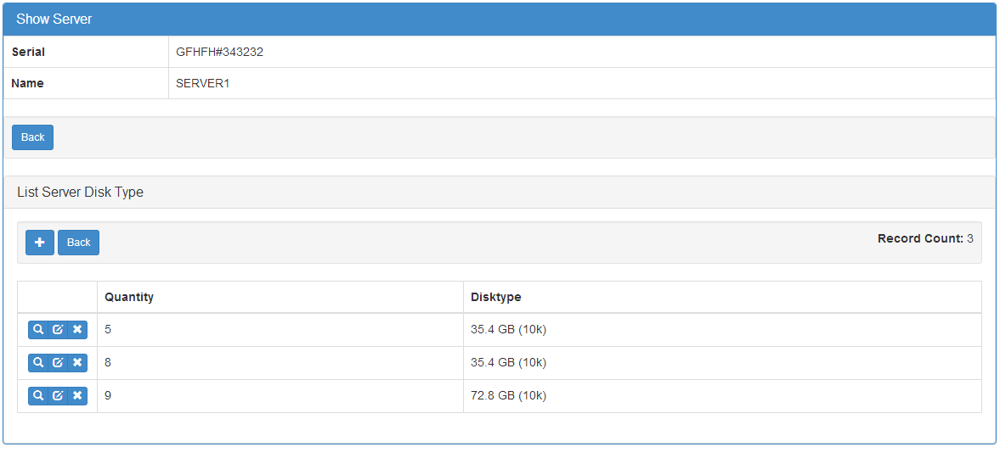

Customizing
===========

You can override and customize almost everything on the UI, or use different templates and widgets already on the framework.

Even better you can develop your own widgets or templates and contribute to the project.

Changing themes
---------------

F.A.B comes with bootswatch themes ready to use, to change bootstrap default theme just change the APP_THEME key's value.

- On config.py (from flask-appbuilder-skeleton), using spacelab theme::

    APP_THEME = "spacelab.css"

- Not using a config.py on your applications, set the key like this::

	app.config['APP_THEME'] = "spacelab.css"
 
You can choose from the following `themes <https://github.com/dpgaspar/Flask-AppBuilder-Skeleton/blob/master/config.py.tpl>`_  

Changing the index
------------------

The index can be easily overridden by your own.
You must develop your template, then define it in a IndexView and pass it to AppBuilder

The default index template is very simple, you can create your own like this:

1 - Develop your template (on your <PROJECT_NAME>/app/templates/my_index.html)::

    
    
    

      

        <h1>{{_("My App on F.A.B.")}}</h1>
        
{{_("My first app using F.A.B, bla, bla, bla")}}

      

    

    

What happened here? We should always extend from "appbuilder/base.html" this is the base template that will include all CSS's, Javascripts, and construct the menu based on the user's security definition.

Next we will override the "content" block, we could override other areas like CSS, extend CSS, Javascript or extend javascript. We can even override the base.html completely

I've presented the text on the content like::

    {{_("text to be translated")}}

So that we can use Babel to translate our index text

2 - Define an IndexView

Define a special and simple view inherit from IndexView, don't define this view on views.py, put it on a separate file like index.py::

    from flask_appbuilder import IndexView

    class MyIndexView(IndexView):
        index_template = 'my_index.html'

3 - Tell F.A.B to use your index view, when initializing AppBuilder::

    from app.index import MyIndexView

    app = Flask(__name__)
    app.config.from_object('config')
    db = SQLA(app)
    appbuilder = AppBuilder(app, db.session, indexview=MyIndexView)

Of course you can use a more complex index view, you can use any kind of view (BaseView childs), you can even
change relative url path to whatever you want, remember to set **default_view** to your function.

You can override **IndexView** index function to display a different view if a user is logged in or not.

Changing the Footer
-------------------

The default footer can be easily changed by your own. You must develop your template,
to override the existing one.

Develop your jinja2 template and place it on the following relative path to override the F.A.B footer.

./your_root_project_path/app/templates/appbuilder/footer.html

Actually you can override any given F.A.B. template.

Changing Menu Construction
--------------------------

You can change the way the menu is constructed adding your own links, separators and changing the navbar reverse property.

By default menu is constructed based on your classes and in a reversed navbar. Let's take a quick look on how to easily change this

	- Change the reversed navbar style, on AppBuilder initialization::
	
		appbuilder = AppBuilder(app, db, menu=Menu(reverse=False))
		
	- Add your own menu links, on a default reversed navbar::

            # Register a view, rendering a top menu without icon
            appbuilder.add_view(MyModelView, "My View")
            # Register a view, a submenu "Other View" from "Other" with a phone icon
            appbuilder.add_view(MyOtherModelView, "Other View", icon='fa-phone', category="Others")
            # Register a view, with label for babel support (internationalization), setup an icon for the category.
            appbuilder.add_view(MyOtherModelView, "Other View", icon='fa-phone', label=lazy_gettext('Other View'),
                            category="Others", category_label=lazy_gettext('Other'), category_label='fa-envelope')
            # Add a link
            appbuilder.add_link("google", href="www.google.com", icon = "fa-google-plus")
		
	- Add separators::

		# Register a view, rendering a top menu without icon
		appbuilder.add_view(MyModelView1, "My View 1", category="My Views")
		appbuilder.add_view(MyModelView2, "My View 2", category="My Views")
		appbuilder.add_separator("My Views")
		appbuilder.add_view(MyModelView3, "My View 3", category="My Views")
		

Using *label* argument is optional for view name or category, but it's advised for internationalization, if you use it with Babel's *lazy_gettext* function it will automate translation's extraction.

Category icon and label can be setup only for the first time. Internally F.A.B. has already stored it, next references will be made by name.

Changing Widgets and Templates
------------------------------

F.A.B. has a collection of widgets to change your views presentation,
you can create your own and override,
or (even better) create them and contribute to the project on git.

All views have templates that will display widgets in a certain layout.
For example, on the edit or show view, you can display the related list (from *related_views*) on the same page,
or as tab (default).::

    class ServerDiskTypeModelView(ModelView):
        datamodel = SQLAInterface(ServerDiskType)
        list_columns = ['quantity', 'disktype']

    class ServerModelView(ModelView):
        datamodel = SQLAInterface(Server)
        related_views = [ServerDiskTypeModelView]

        show_template = 'appbuilder/general/model/show_cascade.html'
        edit_template = 'appbuilder/general/model/edit_cascade.html'

        list_columns = ['name', 'serial']
        order_columns = ['name', 'serial']
        search_columns = ['name', 'serial']
        
        
The above example will override the show and edit templates that will change the related lists layout presentation.

If you want to change the above example, and change the way the server disks are displayed has a list just use the available widgets::

    class ServerDiskTypeModelView(ModelView):
        datamodel = SQLAInterface(ServerDiskType)
        list_columns = ['quantity', 'disktype']
        list_widget = ListBlock

    class ServerModelView(ModelView):
        datamodel = SQLAInterface(Server)
        related_views = [ServerDiskTypeModelView]

        show_template = 'appbuilder/general/model/show_cascade.html'
        edit_template = 'appbuilder/general/model/edit_cascade.html'

        list_columns = ['name', 'serial']
        order_columns = ['name', 'serial']
        search_columns = ['name', 'serial']

We have overridden the list_widget property with the ListBlock Class. This will look like this.

.. image:: ./images/list_cascade_block.png
    :width: 100%

You have the following widgets already available

- ListWidget (default)
- ListItem
- ListThumbnail
- ListBlock

If you want to develop your own widgets just look at the 
`code <https://github.com/dpgaspar/Flask-AppBuilder/tree/master/flask_appbuilder/templates/appbuilder/general/widgets>`_

Read the docs for developing your own template widgets :doc:`templates`

Implement your own and then create a very simple class like this one::

    class MyWidgetList(ListWidget):
        template = '/widgets/my_widget_list.html'
        

Change Default View Behaviour
-----------------------------

If you want to have Add, edit and list on the same page, this can be done. This could be very helpful on master/detail lists (inline) on views based on tables with very few columns.

All you have to do is to mix *CompactCRUDMixin* class with the *ModelView* class.::

    from flask_appbuilder.models.sqla.interface import SQLAInterface
    from flask_appbuilder.views import ModelView, CompactCRUDMixin

    from . import appbuilder
    from .models import Project, ProjectFiles

    class MyInlineView(CompactCRUDMixin, ModelView):
        datamodel = SQLAInterface(MyInlineTable)

    class MyView(ModelView):
        datamodel = SQLAInterface(MyViewTable)
        related_views = [MyInlineView]

    appbuilder.add_view(MyView, "List My View",icon = "fa-table", category = "My Views")
    appbuilder.add_view_no_menu(MyInlineView)

Notice the class mixin, with this configuration you will have a *Master View* with the inline view *MyInlineView* where you can Add and Edit on the same page.

Of course you could use the mixin on *MyView* also, use it only on ModelView classes.

Take a look at the example: https://github.com/dpgaspar/Flask-appBuilder/tree/master/examples/quickfiles

.. image:: ./images/list_compact_inline.png
    :width: 100%

Next we will take a look at a different view behaviour. A master detail style view, master is a view associated with a database table that is linked to the detail view.

Let's assume our quick how to example, a simple contacts applications. We have *Contact* table related with *Group* table.

So we are using master detail view, first we will define the detail view (this view can be customized like the examples above)::

    class ContactModelView(ModelView):
        datamodel = SQLAInterface(Contact)

Then we define the master detail view, where master is the one side of the 1-N relation::

    class GroupMasterView(MasterDetailView):
        datamodel = SQLAInterface(Group)
        related_views = [ContactModelView]

Remember you can use charts has related views, you can use it like this::

    class ContactTimeChartView(TimeChartView):
        datamodel = SQLAInterface(Contact)
        chart_title = 'Grouped Birth contacts'
        chart_type = 'AreaChart'
        label_columns = ContactModelView.label_columns
        group_by_columns = ['birthday']

    class GroupMasterView(MasterDetailView):
        datamodel = SQLAInterface(Group)
        related_views = [ContactModelView, ContactTimeChartView]

This will show a left side menu with the *groups* and a right side list with contacts, and a time chart with the number of birthdays during time by the selected group.

Finally register everything::

    // if Using the above example with related chart
    appbuilder.add_view_no_menu(ContactTimeChartView)

    appbuilder.add_view(GroupMasterView, "List Groups", icon="fa-folder-open-o", category="Contacts")
    appbuilder.add_separator("Contacts")
    appbuilder.add_view(ContactModelView, "List Contacts", icon="fa-envelope", category="Contacts")

.. image:: ./images/list_master_detail.png
    :width: 100%

