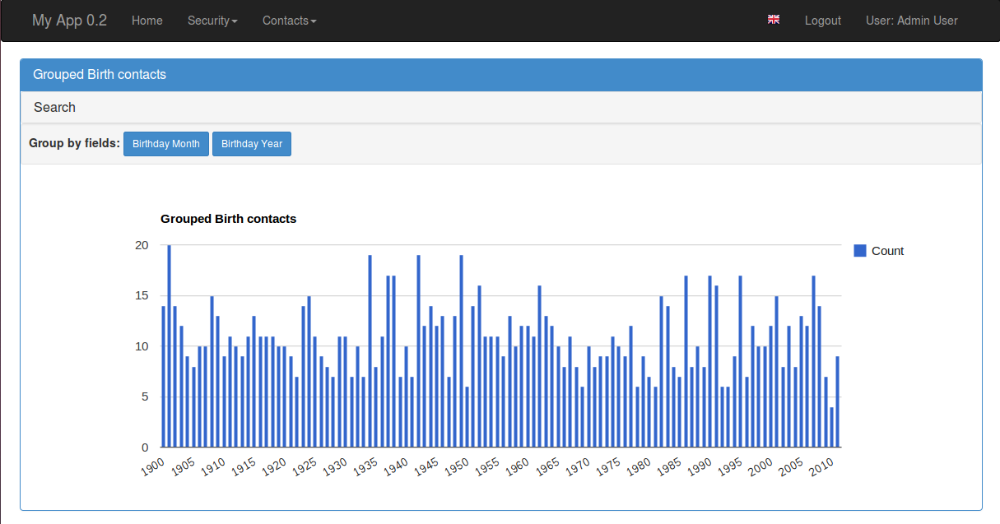

Chart Views
===========

To implement views with google charts, use all inherited classes from BaseChartView, these are:

 :DirectChartView: Display direct data charts with multiple series, no group by is applied.
 :GroupByChartView: Displays grouped data with multiple series.
 :ChartView: (Deprecated) Display simple group by method charts.
 :TimeChartView: (Deprecated) Displays simple group by month and year charts.

You can experiment with some examples on a live
`Demo <http://flaskappbuilder.pythonanywhere.com/>`_ (login has guest/welcome).

Direct Data Charts
------------------

These charts can display multiple series, based on columns or methods defined on models.
You can display multiple charts on the same view.

Let's create a simple model first, the gold is to display a chart showing the unemployment evolution
versus the percentage of the population with higher education, our model will be::

    class CountryStats(Model):
        id = Column(Integer, primary_key=True)
        stat_date = Column(Date, nullable=True)
        population = Column(Float)
        unemployed_perc = Column(Float)
        poor_perc = Column(Float)
        college = Column(Float)

Suppose that the college field will have the total number of college students on some date.
But the *unemployed_perc* field holds a percentage, we can't draw a chart with these two together,
we must create a function to calculate the *college_perc*::

        def college_perc(self):
            if self.population != 0:
                return (self.college*100)/self.population
            else:
                return 0.0

Now we are ready to define our view::

    from flask_appbuilder.charts.views import DirectByChartView
    from flask_appbuilder.models.sqla.interface import SQLAInterface

    class CountryDirectChartView(DirectByChartView):
        datamodel = SQLAInterface(CountryStats)
        chart_title = 'Direct Data Example'

        definitions = [
        {
            'label': 'Unemployment',
            'group': 'stat_date',
            'series': ['unemployed_perc',
                       'college_perc']
        }
    ]

This view definition will produce this:

.. image:: ./images/direct_chart.png
    :width: 100%

The **definitions** property respects the following grammar::

    definitions = [
                    {
                     'label': 'label for chart definition',
                     'group': '<COLNAME>'|'<MODEL FUNCNAME>',
                     'formatter': <FUNC FORMATTER FOR GROUP COL>,
                     'series': ['<COLNAME>'|'<MODEL FUNCNAME>',...]
                    }, ...
                  ]

Where 'label' and 'formatter' are optional parameters.
So on the same view you can have multiple direct chart definitions, like this::

    from flask_appbuilder.charts.views import DirectByChartView
    from flask_appbuilder.models.sqla.interface import SQLAInterface

    class CountryDirectChartView(DirectByChartView):
        datamodel = SQLAInterface(CountryStats)
        chart_title = 'Direct Data Example'

        definitions = [
        {
            'label': 'Unemployment',
            'group': 'stat_date',
            'series': ['unemployed_perc',
                       'college_perc']
        },
        {
            'label': 'Poor',
            'group': 'stat_date',
            'series': ['poor_perc',
                       'college_perc']
        }
    ]

Next register your view like this::

    appbuilder.add_view(CountryDirectChartView, "Show Country Chart", icon="fa-dashboard", category="Statistics")

This kind of chart inherits from **BaseChartView** that has some properties that you can configure
these are:

    :chart_title: The Title of the chart (can be used with babel of course).
    :group_by_label: The label that will be displayed before the buttons for choosing the chart.
    :chart_type: The chart type PieChart, ColumnChart or LineChart
    :chart_3d: = True or false label like: 'true'
    :width: The charts width
    :height: The charts height

Additionally you can configure **BaseModelView** properties because **BaseChartView** is a child.
The most interesting one is

    :base_filters: Defines the filters for data, this has precedence from all UI filters.
    :label_columns: Labeling for charts columns. If not provided the framework will
        generate a pretty version of the columns name.

Grouped Data Charts
-------------------

These charts can display multiple series, based on columns from models or functions defined on the models.
You can display multiple charts on the same view. This data can be grouped and aggregated has you like.

Let's create some simple models first, base on the prior example but this time lets make our models
support has many countries has we like.
The gold is to display a chart showing the unemployment
versus the percentage of the population with higher education per country::

    from flask_appbuilder import Model

    class Country(Model):
        id = Column(Integer, primary_key=True)
        name = Column(String(50), unique = True, nullable=False)

        def __repr__(self):
            return self.name

    class CountryStats(Model):
        id = Column(Integer, primary_key=True)
        stat_date = Column(Date, nullable=True)
        population = Column(Float)
        unemployed_perc = Column(Float)
        poor_perc = Column(Float)
        college = Column(Float)
        country_id = Column(Integer, ForeignKey('country.id'), nullable=False)
        country = relationship("Country")

        def college_perc(self):
            if self.population != 0:
                return (self.college*100)/self.population
            else:
                return 0.0

        def month_year(self):
            return datetime.datetime(self.stat_date.year, self.stat_date.month, 1)

Now we are ready to define our view::

    from flask_appbuilder.charts.views import GroupByChartView
    from flask_appbuilder.models.group import aggregate_count, aggregate_sum, aggregate_avg
    from flask_appbuilder.models.sqla.interface import SQLAInterface

    class CountryGroupByChartView(GroupByChartView):
        datamodel = SQLAInterface(CountryStats)
        chart_title = 'Statistics'

        definitions = [
            {
                'label': 'Country Stat',
                'group': 'country',
                'series': [(aggregate_avg, 'unemployed_perc'),
                           (aggregate_avg, 'population'),
                           (aggregate_avg, 'college_perc')
                          ]
            }
        ]

Next register your view like this::

    appbuilder.add_view(CountryGroupByChartView, "Show Country Chart", icon="fa-dashboard", category="Statistics")

F.A.B. has already some aggregation functions that you can use, for count, sum and average.
On this example we are using average, this will display the historical average of
unemployment and college formation, grouped by country.

A different and interesting example is to group data monthly from all countries, this will show the use of
**formater** property::

    import calendar
    from flask_appbuilder.charts.views import GroupByChartView
    from flask_appbuilder.models.group import aggregate_count, aggregate_sum, aggregate_avg
    from flask_appbuilder.models.sqla.interface import SQLAInterface

    def pretty_month_year(value):
        return calendar.month_name[value.month] + ' ' + str(value.year)

    class CountryGroupByChartView(GroupByChartView):
        datamodel = SQLAInterface(CountryStats)
        chart_title = 'Statistics'

        definitions = [
            {
                'group': 'month_year',
                'formatter': pretty_month_year,
                'series': [(aggregate_avg, 'unemployed_perc'),
                           (aggregate_avg, 'college_perc')
                ]
            }
        ]

This view will group data based on the model's method *month_year* that has the name says will group data
by month and year, this grouping will be processed by averaging data from *unemployed_perc* and *college_perc*.

The group criteria will be formatted for display by *pretty_month_year* function that will change things like
'1990-01' to 'January 1990'

This view definition will produce this:

.. image:: ./images/grouped_chart.png
    :width: 100%

You can create your own aggregation functions and *decorate* them for automatic labeling (and babel).
Has an example let's look at F.A.B.'s code for *aggregate_sum*::

    @aggregate(_('Count of'))
    def aggregate_count(items, col):
        return len(list(items))

The label 'Count of' will be concatenated to your definition of *label_columns* or the pretty version generated
by the framework of the columns them selfs.

(Deprecated) Define your Chart Views (views.py)
-----------------------------------------------

::

    class ContactChartView(ChartView):
        search_columns = ['name','contact_group']
        datamodel = SQLAInterface(Contact)
        chart_title = 'Grouped contacts'
        label_columns = ContactModelView.label_columns
        group_by_columns = ['contact_group']
    	
Notice that:

:label_columns: Are the labels that will be displayed instead of the model's columns name. In this case they are the same labels from ContactModelView.
:group_by_columns: Is a list of columns that you want to group.

this will produce a Pie chart, with the percentage of contacts by group.
If you want a column chart just define::

	chart_type = 'ColumnChart'

You can use 'BarChart', 'LineChart', 'AreaChart' the default is 'PieChart', take a look at the google charts documentation, the *chart_type* is the function on 'google.visualization' object

Let's define a chart grouped by a time frame?

::

    class ContactTimeChartView(TimeChartView):
        search_columns = ['name','contact_group']
        chart_title = 'Grouped Birth contacts'
        label_columns = ContactModelView.label_columns
        group_by_columns = ['birthday']
        datamodel = SQLAInterface(Contact)

this will produce a column chart, with the number of contacts that were born on a particular month or year.
Notice that the label_columns are from and already defined *ContactModelView* take a look at the :doc:`quickhowto`

Finally we will define a direct data chart

::

    class StatsChartView(DirectChartView):
        datamodel = SQLAInterface(Stats)
        chart_title = lazy_gettext('Statistics')
        direct_columns = {'Some Stats': ('stat1', 'col1', 'col2'),
                        'Other Stats': ('stat2', 'col3')}

direct_columns is a dictionary you define to identify a label for your X column, and the Y columns (series) you want to include on the chart

This dictionary is composed by key and a tuple: {'KEY LABEL FOR X COL':('X COL','Y COL','Y2 COL',...),...}

Remember 'X COL', 'Ys COL' are identifying columns from the data model.

Take look at a more detailed example on `quickcharts <https://github.com/dpgaspar/Flask-AppBuilder/tree/master/examples/quickcharts>`_.

Register (views.py)
-------------------

Register everything, to present your charts and create the menu::

    appbuilder.add_view(ContactTimeChartView, "Contacts Birth Chart", icon="fa-envelope", category="Contacts")
    appbuilder.add_view(ContactChartView, "Contacts Chart", icon="fa-dashboard", category="Contacts")

You can find this example at: https://github.com/dpgaspar/Flask-AppBuilder/tree/master/examples/quickhowto

Take a look at the :doc:`api`. For additional customization

.. note::
    You can use charts has related views also, just add them on your related_views properties.

Some images:

.. image:: ./images/chart.png
    :width: 100%

.. image:: ./images/chart_time1.png
    :width: 100%

