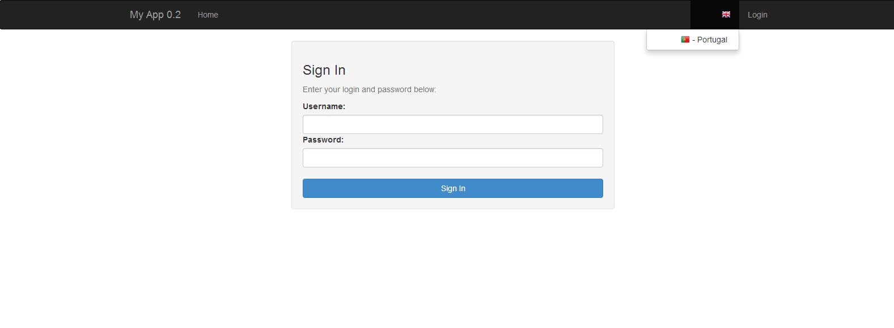
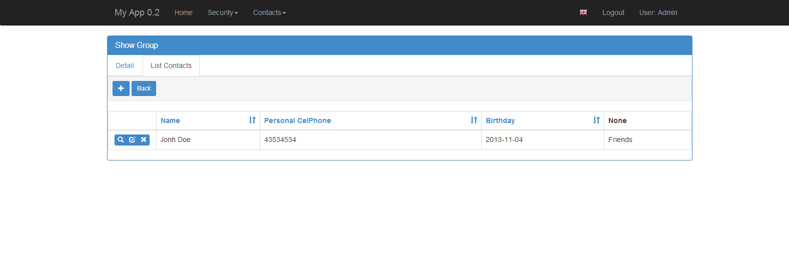

Quick How to
============

The Base Skeleton Application
-----------------------------

If your working with the base skeleton application (see 3 step instalation)

you now have the following directory structure::

    <your project name>/
        config.py : All the applications configuration
        run.py    : A runner mainly for debug
        app/
            __init__.py : Application's initialization
            models.py : Declare your database models here
            views.py  : Implement your views here

    
It's very easy and fast to create an application out of the box, with detailed security.

Please take a look at github examples on:

https://github.com/dpgaspar/Flask-AppBuilder/tree/master/examples

Simple contacts application
---------------------------

Lets create a very simple contacts application.

First let's create a *Group* table to group our contacts

Define your models (models.py)
------------------------------

The group table.

::

        class Group(db.Model):
            id = db.Column(db.Integer, primary_key=True)
            name = db.Column(db.String(50), unique = True, nullable=False)

            def __repr__(self):
                return self.name

An *Contacts* table.

::

	class Contact(db.Model):
	    id = db.Column(db.Integer, primary_key=True)
	    name =  db.Column(db.String(150), unique = True, nullable=False)
	    address =  db.Column(db.String(564))
	    birthday = db.Column(db.Date)
	    photo = db.Column(ImageColumn, nullable=False )
	    personal_phone = db.Column(db.String(20))
	    personal_celphone = db.Column(db.String(20))
	    group_id = db.Column(db.Integer, db.ForeignKey('group.id'))
	    group = db.relationship("Group")		

Define your Views (views.py)
----------------------------

Now we are going to define our view to *Group* table

::
  
        class GroupGeneralView(GeneralView):
            route_base = '/groups'
            datamodel = SQLAModel(Group, db.session)
            related_views = [ContactGeneralView()]

            list_title = 'List Groups'
            show_title = 'Show Group'
            add_title = 'Add Group'
            edit_title = 'Edit Group'

            label_columns = { 'name':'Name'}
            list_columns = ['name']
            show_columns = ['name']
            order_columns = ['name']
            search_columns = ['name']

I hope this was easy enough! Some questions may arrise...

- route_base: is the url where your view will *live* in this case: http://<servername>/groups/
- datamodel: is the db abstraction layer
- related_views: if you want a master/detail view on the show and edit. But where is ContactGeneralView ?

Let's define it::

	class ContactGeneralView(GeneralView):
	    route_base = '/contacts'
	    datamodel = SQLAModel(Contact, db.session)

	    list_title = 'List Contacts'
	    show_title = 'Show Contact'
	    add_title = 'Add Contact'
	    edit_title = 'Edit Contact'
    
	    label_columns = {'name':'Name','photo':'Photo','address':'Address','birthday':'Birthday',
			'personal_phone':'Personal Phone',
			'personal_celphone':'Personal CelPhone'}
	    list_columns = ['name','personal_celphone','birthday','group']

	    order_columns = ['name','personal_celphone','birthday']
	    search_columns = ['name','personal_celphone','group']

	    show_fieldsets = [
                 ('Summary',{'fields':['name','address','group']}),
                 ('Personal Info',{'fields':['birthday','personal_phone','personal_celphone'],'expanded':False}),
                 ]

Register (views.py)
-------------------

Register everything, to present the models and create the menu::

        genapp = BaseApp(app)
        genapp.add_view(GroupGeneralView, "List Groups","/groups/list","th-large","Contacts")
        genapp.add_view(ContactGeneralView, "List Contacts","/contacts/list","earphone","Contacts")

You can find this example at: 

Some images:

.. image:: ./images/groups.png
    :width: 200pt

