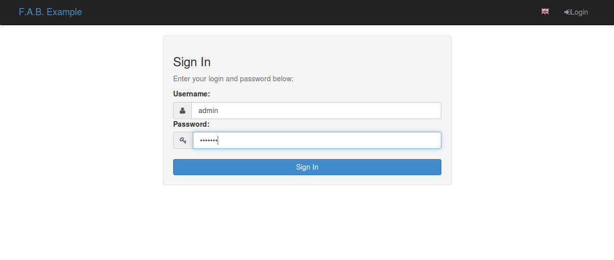
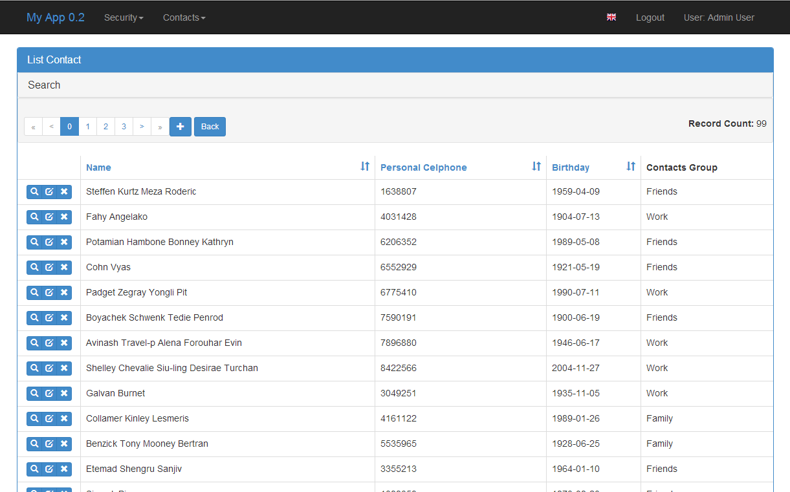

Model Views (Quick How to)
==========================

On this chapter we will create a very simple contacts application you can try a
`Live Demo <http://flaskappbuilder.pythonanywhere.com/>`_ (login with guest/welcome).

And the source code for this chapter on
`examples <https://github.com/dpgaspar/Flask-AppBuilder/tree/master/examples/quickhowto>`_

The Base Skeleton Application
-----------------------------

If your working with the base skeleton application (take a look at the :doc:`installation` chapter).

you now have the following directory structure::

    <your project name>/
        config.py : All the application's configuration
        run.py    : A runner mainly for debug
        app/
            __init__.py : Application's initialization
            models.py : Declare your database models here
            views.py  : Implement your views here

    
It's very easy and fast to create an application out of the box, with detailed security.

Please take a look at github `examples <https://github.com/dpgaspar/Flask-AppBuilder/tree/master/examples>`_

Simple contacts application
---------------------------

Let's create a very simple contacts application.
F.A.B uses the excellent SQLAlchemy ORM package, and it's Flask extension.
you should be familiar with it's declarative syntax to define your database models on F.A.B.

On our example application we are going to define two tables,
a *Contact's* table that will hold the contacts detailed information,
and a *Group* table to group our contacts or classify them.
We could additionally define a *Gender* table, to serve the role of enumerated values for 'Male' and 'Female'.

Although your not obliged to, i advise you to inherit your model classes from **Model** class.
Model class is exactly the same has Flask-SQLALchemy **db.Model** but without the underlying connection.
You can of course inherit from **db.Model** normal Flask-SQLAlchemy.
The reason for this is that **Model** is on the same declarative space of F.A.B.
and using it will allow you to define relations to User's.

You can add automatic *Audit* triggered columns to your models,
by inherit them from *AuditMixin* also. (see :doc:`api`)

So, first we are going to create a *Group* table, to group our contacts

Define your models (models.py)
------------------------------

The *Group* table.

::

    from sqlalchemy import Column, Integer, String, ForeignKey, Date
    from sqlalchemy.orm import relationship
    from flask.ext.appbuilder import Model

    class Group(Model):
        id = Column(Integer, primary_key=True)
        name = Column(String(50), unique = True, nullable=False)

        def __repr__(self):
            return self.name

The *Contacts* table.

::

	class Contact(Model):
	    id = Column(Integer, primary_key=True)
	    name =  Column(String(150), unique = True, nullable=False)
	    address =  Column(String(564), default='Street ')
	    birthday = Column(Date)
	    personal_phone = Column(String(20))
	    personal_celphone = Column(String(20))
	    group_id = Column(Integer, ForeignKey('group.id'))
	    group = relationship("Group")	
	    
	    def __repr__(self):
                return self.name

Notice that SqlAlchemy properties used here like 'unique', 'nullable' and 'default', will have special
treatment. In this case when adding a new *Contact* a query will be made to validate
if a someone with the same name already exists. Empty name contacts will not be allowed. Column types
are validated. The address field will contain 'Street' has default on add form.
You can add your own custom validations also, take a look at :doc:`advanced`

Define your Views (views.py)
----------------------------

Now we are going to define our view for *Group* table.
This view will setup functionality for create, remove, update and show primitives for your model's definition.

Inherit from *ModelView* class that inherits from *BaseCRUDView* that inherits from *BaseModelView*,
so you can override all their public properties to configure many details for your CRUD primitives.
take a look at :doc:`advanced`.

::

    class GroupModelView(ModelView):
        datamodel = SQLAModel(Group)
        related_views = [ContactModelView]

I hope this was easy enough! Some questions may arise...

Must have properties:

:datamodel: is the db abstraction layer. Initialize it with your view's model.

Optional properties:

:related_views: if you want a master/detail view on the show and edit. F.A.B.
    will relate 1/N relations automatically, it will display a show or edit view with tab (or accordion) with a list related record. You can relate charts also.

This is the most basic configuration (with an added related view).

But where is ContactModelView ? (that was a reference in *related_views* list)

Let's define it::

    class ContactModelView(ModelView):
        datamodel = SQLAModel(Contact)

        label_columns = {'group':'Contacts Group'}
        list_columns = ['name','personal_celphone','birthday','group']

        show_fieldsets = [
            ('Summary',{'fields':['name','address','group']}),
            ('Personal Info',{'fields':['birthday','personal_phone','personal_celphone'],'expanded':False}),
            ]

Some explanation:

:label_columns: defines the labels for your columns. The framework will define the missing ones for you, with a pretty version of your column names.
:show_fieldsets: A fieldset (Django style). You can use show_fieldsets, add_fieldsets, edit_fieldsets
    customize the show, add and edit views independently.

Additionally you can customize what columns are displayed and their order on lists and forms.
Remember you can include columns, relations or methods from a model's definition:

.. automodule:: flask.ext.appbuilder.baseviews

    .. autoclass:: BaseCRUDView
        :members: list_columns,add_columns,edit_columns,show_columns

.. note::

    Fields that reference relationships display the defined related model representation
    (on this case __repr__() methos on Group Model), so by default these fields can't be ordered.
    To enable order by on list for relationship fields, you can (since 1.1.1) reference
    them using dotted notation. On this example would be 'group.name'.

Register (views.py)
-------------------

Register everything, to present the models and create the menu. Issue **create_all** to create your models also.

::

        db.create_all()
        appbuilder.add_view(GroupModelView, "List Groups",icon = "fa-folder-open-o",category = "Contacts",
                        category_icon = "fa-envelope")
        appbuilder.add_view(ContactModelView, "List Contacts",icon = "fa-envelope",category = "Contacts")

Take a look at the :doc:`api` for add_view method.

.. note::
	The icons for the menu on this examples are from font-awesome,
	Checkout fontAwesome `Icons <http://fontawesome.io/icons/>`_ names.
	Font-Awesome is already included and you can use any icon you like on menus and actions
	
With this very few lines of code (and could be fewer), you now have a web application
with detailed security for each CRUD primitives and Menu options, authentication,
and form field validation. Yet you can extensively change many details,
add your own triggers before or after CRUD primitives, develop your own web views and integrate them.

Exposed methods and JSON
------------------------

Your **ModelView** classes expose the following methods has flask endpoints

- list
- show
- add
- edit
- delete
- download
- action
- json

This exposes a REST API, note the *json* method, it will return query results just like the *list*
method, try it, you can use it on your own template implementations, it will return a JSON object
with the columns to list, to order, the label's for the columns (already translated), the full
query count, and of course the query results, it supports pagination also.

*json* method uses the *list* method security name 'can_list'.

You can find this example at: https://github.com/dpgaspar/Flask-AppBuilder/tree/master/examples/quickhowto

Live quickhowto `Demo <http://flaskappbuilder.pythonanywhere.com/>`_ (login with guest/welcome).

Some images:

.. image:: ./images/group_list.png
    :width: 100%

