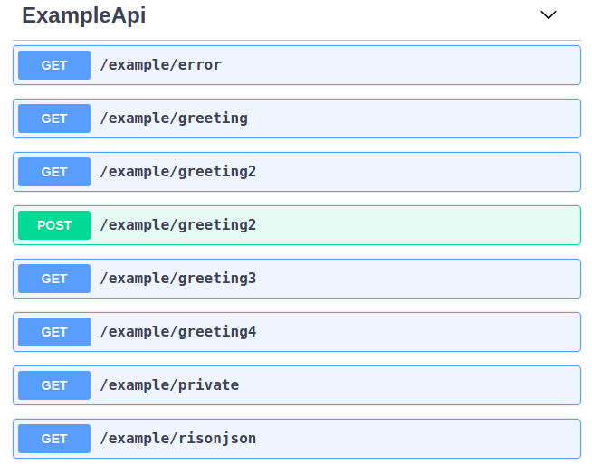
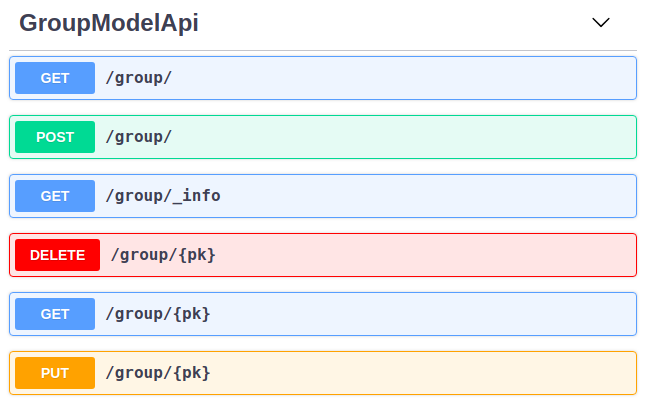

REST API
========

On this chapter we are going to describe how you can define a RESTful API
using almost the same concept as defining your MVC views.

:note:
    Follow this example on Flask-AppBuilder project ./examples/base_api/

First let's see a basic example on how you can define your own
custom API endpoints::

    from flask_appbuilder.api import BaseApi, expose
    from . import appbuilder

    class ExampleApi(BaseApi):
        @expose('/greeting')
        def greeting(self):
            return self.response(200, message="Hello")

    appbuilder.add_api(ExampleApi)

On the previous example, we are exposing an HTTP GET endpoint,
that returns the following JSON payload::

    {
        "message": "Hello"
    }

The ``@expose`` decorator registers your class method as a Flask route that is going
to be associated with a Flask blueprint. A ``BaseApi`` class defines a blueprint that
contains all exposed methods. By default the base route of the class blueprint is
defined by:

``/api/v1/<LOWERCASE_CLASS_NAME>``

So we can make a request to our method using::

    $ curl http://localhost:8080/api/v1/exampleapi/greeting

To override the base route class blueprint, override the ``base_route`` property,
so on our previous example::

    from flask_appbuilder.api import BaseApi, expose
    from . import appbuilder

    class ExampleApi(BaseApi):

        base_route = '/newapi/v2/nice'

        @expose('/greeting')
        def greeting(self):
            return self.response(200, message="Hello")

    appbuilder.add_api(ExampleApi)

Now our endpoint will be::

    $ curl http://localhost:8080/newapi/v2/nice/greeting

We can also just override the version and/or resource name,
using ``version`` and ``resource_name`` properties::

    from flask_appbuilder.api import BaseApi, expose
    from . import appbuilder

    class ExampleApi(BaseApi):

        resource_name = 'example'

        @expose('/greeting')
        def greeting(self):
            return self.response(200, message="Hello")

    appbuilder.add_api(ExampleApi)

Now our endpoint will be::

    $ curl http://localhost:8080/api/v1/example/greeting

The other HTTP methods (PUT, POST, DELETE, ...) can be defined just like
a Flask route signature::

    from flask import request
    from flask_appbuilder.api import BaseApi, expose

    class ExampleApi(BaseApi):

        ....

        @expose('/greeting2', methods=['POST', 'GET'])
        def greeting2(self):
            if request.method == 'GET':
                return self.response(200, message="Hello (GET)")
            return self.response(201, message="Hello (POST)")

The previous example will expose a new `greeting2` endpoint on HTTP GET and POST
so we can request it by::

    $ curl http://localhost:8080/api/v1/example/greeting2
    {
        "message": "Hello (GET)"
    }
    $ curl -XPOST http://localhost:8080/api/v1/example/greeting2
    {
        "message": "Hello (POST)"
    }

Let's make our method a bit more interesting, and send our name on the HTTP
GET method. You can optionally use a ``@rison`` decorator that will parse
the HTTP URI arguments from a *Rison* structure to a python data structure.
On this example it may seem a bit overboard but with *Rison* we can handle
complex HTTP GET arguments in a human readable and predictable way.
*Rison* is a slight variation of JSON that looks vastly superior after URI encoding.
Rison still expresses exactly the same set of data structures as JSON,
so data can be translated back and forth without loss or guesswork::

    from flask_appbuilder.api import BaseApi, expose, rison

    class ExampleApi(BaseApi):

        ...

        @expose('/greeting3')
        @rison()
        def greeting3(self, **kwargs):
            if 'name' in kwargs['rison']:
                return self.response(
                    200,
                    message=f"Hello {kwargs['rison']['name']}"
                )
            return self.response_400(message="Please send your name")

And to test our method::

    $ curl 'http://localhost:8080/api/v1/example/greeting3?q=(name:daniel)'
    {
        "message": "Hello daniel"
    }

To test this concept let's create a new method where we send a somewhat complex
data structure that will use numbers, booleans and lists, and send it back JSON formatted.
First our data structure, let's first think JSON::

    {
        "bool": true,
        "list": ["a", "b", "c"],
        "number": 777,
        "string": "string"
        "null": null
    }

On *Rison* format::

    (bool:!t,list:!(a,b,c),null:!n,number:777,string:'string')

Behind the scenes FAB is using *prison* a very nicely done fork developed by @betodealmeida
We can use this package, to help us dump or load python structures to Rison::

    import prison
    b = {
        "bool": True,
        "list": ["a", "b", "c"],
        "number": 777,
        "string": "string",
        "null": None
    }

    print(prison.dumps(b))

So to test our concept::

    ...

    @expose('/risonjson')
    @rison()
    def rison_json(self, **kwargs):
        return self.response(200, result=kwargs['rison'])

Then call it::

    $ curl 'http://localhost:8080/api/v1/example/risonjson?q=(bool:!t,list:!(a,b,c),null:!n,number:777,string:'string')'
    {
      "result": {
        "bool": true,
        "list": [
          "a",
          "b",
          "c"
        ],
        "null": null,
        "number": 777,
        "string": "string"
      }
    }

Notice how the data types are preserved. Remember that we are building a Flask app
so you can always use *normal* URI arguments using Flask's ``request.args``

If we send an invalid *Rison* argument we get an error::

    $ curl -v 'http://localhost:8080/api/v1/example/risonjson?q=(bool:!t'
    ...
    < HTTP/1.0 400 BAD REQUEST
    < Content-Type: application/json; charset=utf-8
    ...
    {
      "message": "Not a valid rison argument"
    }

You can additionally pass a JSON schema to
validate your Rison arguments, this way you can implement a very strict API easily::

    schema = {
        "type": "object",
        "properties": {
            "name": {
                "type": "string"
            }
        }
    }
    ...

    @expose('/greeting4')
    @rison(schema)
    def greeting4(self, **kwargs):
        return self.response(
            200,
            message=f"Hello {kwargs['rison']['name']}"
        )

Finally to properly handle all possible exceptions use the ``safe`` decorator,
that will catch all uncaught exceptions for you and return a proper error response.
You can enable or disable stack trace response using the
``FAB_API_SHOW_STACKTRACE`` configuration key::

        from flask_appbuilder.api import BaseApi, expose, rison, safe

        ...

        @expose('/error')
        @safe
        def error(self):
            raise Exception

OpenAPI spec
------------

We can define an OpenAPI specification by using YAML on the docs section of our
methods::

    @expose('/greeting')
    def greeting(self):
        """Send a greeting
        ---
        get:
          responses:
            200:
              description: Greet the user
              content:
                application/json:
                  schema:
                    type: object
                    properties:
                      message:
                        type: string
        """
        return self.response(200, message="Hello")

We are defining that, our endpoint will respond to HTTP GET with a JSON object that contains
a key ``message`` with values of type **string**. To access all our OpenAPI specifications
request it on ``/api/v1/_openapi``, this is a dynamic endpoint that will serve all specs
from different API versions. So if we register an API for version **v2** we access it's
spec on ``/api/v2/_openapi``. Please note that OpenAPI specs are subject to authentication.

So our spec for a method that accepts two HTTP verbs::

    @expose('/greeting2', methods=['POST', 'GET'])
    def greeting2(self):
        """Send a greeting
        ---
        get:
          responses:
            200:
              description: Greet the user
              content:
                application/json:
                  schema:
                    type: object
                    properties:
                      message:
                        type: string
        post:
          responses:
            201:
              description: Greet the user
              content:
                application/json:
                  schema:
                    type: object
                    properties:
                      message:
                        type: string
        """
        if request.method == 'GET':
            return self.response(200, message="Hello (GET)")
        return self.response(201, message="Hello (POST)")

To access Swagger UI you must enable ``FAB_API_SWAGGER_UI = True`` on your config file
then goto ``http://localhost:8080/swagger/v1`` for OpenAPI **v1** definitions
On Swagger UI our example API looks like:

Notice the ``get`` and ``put`` structures, we should always detail all our
possible responses. The ``BaseApi`` class comes with some pre packaged HTTP
responses we can use for the sake of brevity::

    @expose('/error')
    @protect()
    @safe
    def error(self):
        """Error 500
        ---
        get:
          responses:
            500:
              $ref: '#/components/responses/500'
        """
        raise Exception

A complete list of packaged responses you can use::

          responses:
            400:
              $ref: '#/components/responses/400'
            401:
              $ref: '#/components/responses/401'
            404:
              $ref: '#/components/responses/404'
            422:
              $ref: '#/components/responses/422'
            500:
              $ref: '#/components/responses/500'

The automatic OpenAPI spec generation also supports **Rison** arguments and their
json schema spec. Since both are compatible we can reuse our Json schema spec on OpenAPI.
First we need to register our spec, using ``apispec_parameter_schemas`` dictionary::

    class ExampleApi(BaseApi):

        resource_name = 'example'
        apispec_parameter_schemas = {
            "greeting_schema": greeting_schema
        }

FAB will register your schema on ``/components/parameters``, so you can now
easily reference them::

        @expose('/greeting4')
        @rison(greeting_schema)
        def greeting4(self, **kwargs):
            """Get item from Model
            ---
            get:
              parameters:
              - $ref: '#/components/parameters/greeting_schema'
              responses:
                200:
                  description: Greet the user
                  content:
                    application/json:
                      schema:
                        type: object
                        properties:
                          message:
                            type: string
            """
            return self.response(
                200,
                message=f"Hello {kwargs['rison']['name']}"
            )

Security
--------

FAB offers user management, several authentication backends and granular role base access
so we can use these features on the API also. Default API authentication method is done
using JSON Web Tokens (JWT).

:tip:

    FAB's JWT authentication is done with flask-jwt-extended.
    Checkout it's documentation for custom configuration:
    https://flask-jwt-extended.readthedocs.io/en/latest/options.html

Next, let's see how to create a private method::

    from flask import request
    from flask_appbuilder.api import BaseApi, expose, rison
    from flask_appbuilder.security.decorators import protect
    from . import appbuilder

    class ExampleApi(BaseApi):

        ...
        @expose('/private')
        @protect()
        def rison_json(self):
            """Say it's risonjson
            ---
            get:
              responses:
                200:
                  description: Say it's private
                  content:
                    application/json:
                      schema:
                        type: object
                401:
                  $ref: '#/components/responses/401'
            """
            return self.response(200, message="This is private")

    appbuilder.add_api(ExampleApi)

Accessing this method as expected will
return an HTTP 401 not authorized code and message::

    $ curl -v 'http://localhost:8080/api/v1/example/private'
    ...
    < HTTP/1.0 401 UNAUTHORIZED
    < Content-Type: application/json
    ...
    {
        "msg": "Missing Authorization Header"
    }

So we need to first obtain our JSON Web token, for this, FAB registers a login endpoint.
For this we POST request with a JSON payload using::

    {
        "username": "<USERNAME>",
        "password": "<PASSWORD>",
        "provider": "db|ldap"
    }

Notice the *provider* argument, FAB currently supports DB and LDAP
authentication backends for the Api. The login endpoint returns a fresh **access token** and optionally
a **refresh token**. You can renew the **access token** using the **refresh token** but this time
the returned token will not be fresh. To obtain a new non fresh access token
use ``refresh`` endpoint with the **refresh token**. To obtain a **refresh token** on the login endpoint
send the optional parameter **"refresh": true** on the JSON PUT payload.

Let's request our Token then::

    # If not already, create an admin user
    $ export FLASK_APP=app
    $ flask fab create-admin
    Username [admin]:
    User first name [admin]:
    User last name [user]:
    Email [admin@fab.org]:
    Password:
    Repeat for confirmation:
    ...
    Admin User admin created.

    # Login to obtain a token
    $ curl -XPOST http://localhost:8080/api/v1/security/login -d \
      '{"username": "admin", "password": "password", "provider": "db"}' \
      -H "Content-Type: application/json"
    {
        "access_token": "<SOME TOKEN>"
    }
    # It's nice to use the Token as an env var
    $ export TOKEN="<SOME TOKEN>"

Next we can use our token on protected endpoints::

    $ curl 'http://localhost:8080/api/v1/example/private' -H "Authorization: Bearer $TOKEN"
    {
        "message": "This is private"
    }

As always FAB created a new **can_private** permission
on the DB named "can private on ExampleApi"
Note that you can protect all your methods and make
them public or not by adding them to the *Public* Role.

Also to restrict the default permissions we can use ``base_permissions``
list property. This can be specially useful on ``ModelRestApi`` (up next)
where we can restrict our Api resources to be read only, or only allow POST
methods::

    class ExampleApi(BaseApi):
        base_permissions = ['can_private']

You can create an alternate JWT user loader, this can be useful if you want
to use an external Authentication provider and map the JWT identity to your
user Model::

    @appbuilder.sm.jwt_manager.user_loader_callback_loader
    def alternate_user_loader(identity):
        # find the user by it's identity
        ...
        return user

Optionally you can enable signed cookie sessions (from flask-login) on the
API. You can do it class or method wide::

    class ExampleApi(BaseApi):
        allow_browser_login = True

The previous example will enable cookie sessions on the all class::

    class ExampleApi(BaseApi):

        @expose('/private')
        @protect(allow_browser_login=True)
        def private(self)
            ....

On the previous example, we are enabling signed cookies on the ``private`` method. Note that even then 
a valid JWT is also accepted.

Model REST API
--------------

To automatically create a RESTfull CRUD Api from a database *Model*, use ``ModelRestApi`` class and
define it almost like an MVC ``ModelView``. This class will expose the following REST endpoints

:note:
    Follow this example on Flask-AppBuilder project ./examples/crud_rest_api/

    .. cssclass:: table-bordered table-hover

+-----------------------------+-------------------------------------------------------+-----------------+--------+
| URL                         | Description                                           | Permission Name | HTTP   |
+=============================+=======================================================+=================+========+
| /_info                      | Returns info about the CRUD model and security        | can_info        | GET    |
+-----------------------------+-------------------------------------------------------+-----------------+--------+
| /                           | Queries models data, receives args as Rison           | can_get         | GET    |
+-----------------------------+-------------------------------------------------------+-----------------+--------+
| /<PK>                       | Returns a single model from it's primary key (id)     | can_get         | GET    |
+-----------------------------+-------------------------------------------------------+-----------------+--------+
| /                           | Receives a JSON payload as POST and creates record    | can_post        | POST   |
+-----------------------------+-------------------------------------------------------+-----------------+--------+
| /                           | Receives a JSON payload as PUT and updates record     | can_put         | PUT    |
+-----------------------------+-------------------------------------------------------+-----------------+--------+
| /<PK>                       | Deletes a single model from it's primary key (id)     | can_delete      | DELETE |
+-----------------------------+-------------------------------------------------------+-----------------+--------+

For each ``ModelRestApi`` you will get 5 CRUD endpoints and an extra information method.
All created CRUD endpoints have their OpenAPI spec accessible on ``/api/<version>/_openapi``,
each class is tagged so the CRUD endpoints get nicely grouped when using Swagger UI.
Notice that ``ModelRestApi`` will generate a complete OpenAPI schema models for you data,
so you can get free documentation for you API's.

FAB will create all possible permissions and add them to the ``AUTH_ROLE_ADMIN`` config key
that defaults to **Admin**. you can completely override the default inferred permissions
and reduce the level of granularity, for more detail about this read the :doc:`security` chapter.

Let's dive into a simple example using the quickhowto.
The quickhowto example has a Contact's Model and a Group Model,
so each Contact belongs to a Group.

First let's define a CRUD REST Api for our Group model resource::

    from flask_appbuilder.models.sqla.interface import SQLAInterface
    from flask_appbuilder.api import ModelRestApi
    from . import appbuilder

    class GroupModelApi(ModelRestApi):
        resource_name = 'group'
        datamodel = SQLAInterface(ContactGroup)

    appbuilder.add_api(GroupModelApi)

Behind the scenes FAB uses marshmallow-sqlalchemy to infer the Model to a Marshmallow Schema,
that can be safely serialized and deserialized. Let's recall our Model definition for ``ContactGroup``::

    class ContactGroup(Model):
        id = Column(Integer, primary_key=True)
        name = Column(String(50), unique=True, nullable=False)

        def __repr__(self):
            return self.name

Swagger UI API representation for groups (http://localhost:8080/swagger/v1):

All endpoints are protected so we need to request a JWT and use it on our REST resource,
like shown before we need to make a PUT request to the login API endpoint::

    # Login to obtain a token
    $ curl -XPOST http://localhost:8080/api/v1/security/login -d \
      '{"username": "admin", "password": "password", "provider": "db"}' \
      -H "Content-Type: application/json"
    {
        "access_token": "<SOME TOKEN>"
    }
    # It's nice to use the Token as an env var
    $ export TOKEN="<SOME TOKEN>"

First let's create a Group::

    $ curl -XPOST http://localhost:8080/api/v1/group/ -d \
     '{"name": "Friends"}' \
     -H "Content-Type: application/json" \
     -H "Authorization: Bearer $TOKEN"
    {
        "id": 1,
        "result": {
            "name": "Friends"
        }
    }

We got back a response with the model id and result with the inserted data.
Now let's query our newly created Group::

    $ curl http://localhost:8080/api/v1/group/1 \
     -H "Content-Type: application/json" \
     -H "Authorization: Bearer $TOKEN"

    {
        "description_columns": {},
        "show_title": "Show Contact Group",
        "show_columns": [
            "name"
        ],
        "label_columns": {
            "name": "Name"
        },
        "id": "1",
        "result": {
           "name": "Friends"
        }
    }

As you can see, the API returns the model data, and extra meta data so you can properly render
a page with labels, descriptions and defined column order. This way it should be possible
to develop a React component (for example) that renders any model just by switching between HTTP endpoints.
It's also possible to just ask for certain meta data keys, we will talk about this later.

Next let's change our newly created model (HTTP PUT)::

    $ curl -XPUT http://localhost:8080/api/v1/group/1 -d \
     '{"name": "Friends Changed"}' \
     -H "Content-Type: application/json" \
     -H "Authorization: Bearer $TOKEN"
    {
        "result": {
            "name": "Friends Changed"
        }
    }

And finally test the delete method (HTTP DELETE)::

    $ curl -XDELETE http://localhost:8080/api/v1/group/1 \
     -H "Content-Type: application/json" \
     -H "Authorization: Bearer $TOKEN"
    {
        "message": "OK"
    }

Let's check if it exists (HTTP GET)::

    $ curl http://localhost:8080/api/v1/group/1 \
     -H "Content-Type: application/json" \
     -H "Authorization: Bearer $TOKEN"
    {
        "message": "Not found"
    }

We get an HTTP 404 (Not found).

Information endpoint
--------------------

This endpoint serves as a method to fetch meta information about our CRUD
methods. Again the main purpose to serve meta data is to make possible for a frontend
layer to be able to render dynamically:

- Search options

- Forms

- Enable/disable features based on permissions.

First a birds eye view from the output of the **_info** endpoint::

    {
        "add_columns": [...],
        "edit_columns": [...],
        "add_title": "...",
        "edit_title": "...",
        "filters": {...},
        "permissions": [...]
    }

Let's drill down this data structure, ``add_columns`` and ``edit_columns`` are similar
and serve to aid on rendering forms for add and edit so their response contains the
following data structure::

    {
        "add_columns": [
            {
                "description": "<COL_DESCRIPTION>",
                "label": "<COL_LABEL>",
                "name": "<COL_NAME>",
                "required": true|false,
                "unique": true|false,
                "type": "String|Integer|Related|RelatedList|...",
                "validate": [ ... list of validation methods ... ]
                "count": <optional number>
                "values" : [ ... optional with all possible values for a related field ... ]
            },
            ...
        ]
    }

Edit fields ``edit_columns`` is similar, but it's content may be different, since
we can configure it in a distinct way

Next, filters, this returns all the necessary info to render all possible filters allowed
by the backend database for each field on the model::

    {
        "filters": {
            "<COL_NAME>": [
                {
                    "name": "<HUMAN READABLE AND I18N>",
                    "operator": "<OPERATION_NAME>"
                },
                ...
            ],
            ...
        }
    }

Note that the **operator** value can be used to filter our list queries,
more about this later.

Finally the permissions, this declares all allowed permissions for the current user.
Remember that these can extend the automatic HTTP methods generated by ``ModelRestApi``
by just defining new methods and protecting them with the ``protect`` decorator::

    {
        "permissions": ["can_get", "can_put", ... ]
    }

On all GET HTTP methods we can select which meta data keys we want, this can
be done using *Rison* URI arguments. So the **_info** endpoint is no exception.
The across the board way to filter meta data is to send a GET request
using the following structure::

    {
        "keys": [ ... LIST OF META DATA KEYS ... ]
    }

That translates to the following in *Rison* for fetching just the permissions meta data::

    (keys:!(permissions))

So, back to our example::

    $ curl 'http://localhost:8080/api/v1/group/_info?q=(keys:!(permissions))' \
    -H "Content-Type: application/json" \
    -H "Authorization: Bearer $TOKEN"
    {
        "permissions": [
            "can_get",
            "can_post",
            "can_put",
            "can_delete"
        ]
    }

And to fetch the permissions and Add form fields info::

    $ curl 'http://localhost:8080/api/v1/group/_info?q=(keys:!(permissions,add_columns))' \
    -H "Content-Type: application/json" \
    -H "Authorization: Bearer $TOKEN"
    {
        "add_columns": [ ... ],
        "permissions": [
            "can_get",
            "can_post",
            "can_put",
            "can_delete"
        ]
    }

To fetch meta data with internationalization use **_l_** URI key argument with i18n
country code as the value. This will work on any HTTP GET endpoint::

    $ curl 'http://localhost:8080/api/v1/group/_info?q=(keys:!(permissions,add_columns))&_l_=pt' \
    -H "Content-Type: application/json" \
    -H "Authorization: Bearer $TOKEN"
    {
        "add_columns": [ ... ],
        "permissions": [
            "can_get",
            "can_post",
            "can_put",
            "can_delete"
        ]
    }

Render meta data with *Portuguese*, labels, description, filters

The ``add_columns`` and ``edit_columns`` keys also render all possible
values from related fields, using our *quickhowto* example::

    {
        "add_columns": [
            {
                "description": "",
                "label": "Gender",
                "name": "gender",
                "required": false,
                "unique": false,
                "type": "Related",
                "count": 2,
                "values": [
                    {
                      "id": 1,
                      "value": "Male"
                    },
                    {
                      "id": 2,
                      "value": "Female"
                    }
                ]
            },
            ...
        ]
    }

These related field values can be filtered server side using the ``add_query_rel_fields``
or ``edit_query_rel_fields``::

    class ContactModelApi(ModelRestApi):
        resource_name = 'contact'
        datamodel = SQLAInterface(Contact)
        add_query_rel_fields = {
            'gender': [['name', FilterStartsWith, 'F']]
        }

You can also impose an order for these values server side using ``order_rel_fields``::

    class ContactModelApi(ModelRestApi):
        resource_name = 'contact'
        datamodel = SQLAInterface(Contact)
        order_rel_fields = {
            'contact_group': ('name', 'asc'),
            'gender': ('name', 'asc')
        }

The previous example will filter out only the **Female** gender from our list
of possible values

Note that these related fields may render a long list of values, so pagination
is available and subject to a max page size. You can paginate these values using
the following Rison argument structure::

    {
        "add_columns": {
            <COL_NAME> : {
                'page': int,
                'page_size': int
            }
        }
    }

Using Rison example::

    (add_columns:(contact_group:(page:0,page_size:10)))

We can also restrict server side the available fields for add and edit using ``add_columns``
and ``edit_columns``. Additionally you can use ``add_exclude_columns`` and ``edit_exclude_columns``::

    class ContactModelApi(ModelRestApi):
        resource_name = 'contact'
        datamodel = SQLAInterface(Contact)
        add_columns = ['name']

Will only return the field *name* from our *Contact* model information endpoint for ``add_fields``

Get Item
--------

The get item endpoint is very simple, and was already covered to some extent.
The response data structure is::

    {
        "id": "<Primary Key>"
        "description_columnns": {},
        "label_columns": {},
        "show_columns": [],
        "show_title": "",
        "result": {}
    }

Now we are going to cover the *Rison* arguments for custom fetching
meta data keys or columns. This time the accepted arguments are slightly extended::

    {
        "keys": [ ... List of meta data keys to return ... ],
        "columns": [ ... List of columns to return ... ]
    }

So for fetching only the *name* and *address* for a certain *Contact*, using *Rison*::

    (columns:!(name,address))

Our *curl* command will look like::

    curl 'http://localhost:8080/api/v1/contact/1?q=(columns:!(name,address))' \
    -H "Content-Type: application/json" \
    -H "Authorization: Bearer $TOKEN"
    {
      "description_columns": {},
      "id": "1",
      "show_columns": [
        "name",
        "address"
      ],
      "show_title": "Show Contact",
      "label_columns": {
        "address": "Address",
        "name": "Name"
      },
      "result": {
        "address": "Street phoung",
        "name": "Wilko Kamboh"
      }
    }

And to only include the *label_columns* meta data, *Rison* data structure::

    (columns:!(name,address),keys:!(label_columns))

Our *curl* command will look like::

    curl 'http://localhost:8080/api/v1/contact/1?q=(columns:!(name,address),keys:!(label_columns))' \
    -H "Content-Type: application/json" \
    -H "Authorization: Bearer $TOKEN"
    {
      "id": "1",
      "label_columns": {
        "address": "Address",
        "name": "Name"
      },
      "result": {
        "address": "Street phoung",
        "name": "Wilko Kamboh"
      }
    }

To discard completely all meta data use the special key ``none``::

    (columns:!(name,address),keys:!(none))

Our *curl* command will look like::

    curl 'http://localhost:8080/api/v1/contact/1?q=(columns:!(name,address),keys:!(none))' \
    -H "Content-Type: application/json" \
    -H "Authorization: Bearer $TOKEN"
    {
      "id": "1",
      "result": {
        "address": "Street phoung",
        "name": "Wilko Kamboh"
      }
    }

We can restrict or add fields for the get item endpoint using
the ``show_columns`` property. This takes precedence from the *Rison* arguments::

    class ContactModelApi(ModelRestApi):
        resource_name = 'contact'
        datamodel = SQLAInterface(Contact)
        show_columns = ['name']

By default FAB will issue a query containing the exact fields for `show_columns`, but these are also associated with
the response object. Sometimes it's useful to distinguish between the query select columns and the response itself.
Imagine the case you want to use a `@property` to further transform the output, and that transformation implies
two model fields (concat or sum for example)::

    class ContactModelApi(ModelRestApi):
        resource_name = 'contact'
        datamodel = SQLAInterface(Contact)
        show_columns = ['name', 'age']
        show_select_columns = ['name', 'birthday']

The Model::

    class Contact(Model):
        id = Column(Integer, primary_key=True)
        name = Column(String(150), unique=True, nullable=False)
        ...
        birthday = Column(Date, nullable=True)
        ...

        @property
        def age(self):
            return date.today().year - self.birthday.year

Note: The same logic is applied on `list_select_columns`

We can add fields that are python functions also, for this on the SQLAlchemy definition,
let's add a new function::

    class Contact(Model):
        id = Column(Integer, primary_key=True)
        name = Column(String(150), unique=True, nullable=False)
        address = Column(String(564))
        birthday = Column(Date, nullable=True)
        personal_phone = Column(String(20))
        personal_celphone = Column(String(20))
        contact_group_id = Column(Integer, ForeignKey('contact_group.id'), nullable=False)
        contact_group = relationship("ContactGroup")
        gender_id = Column(Integer, ForeignKey('gender.id'), nullable=False)
        gender = relationship("Gender")

        def __repr__(self):
            return self.name

        def some_function(self):
            return f"Hello {self.name}"

And then on the REST API::

    class ContactModelApi(ModelRestApi):
        resource_name = 'contact'
        datamodel = SQLAInterface(Contact)
        show_columns = ['name', 'some_function']

The ``show_columns`` is also useful to impose an order on the columns.
Again this is useful to develop a dynamic frontend show item page/component
by using the *include_columns* meta data key.

Note that this can be done on the query list endpoint also using ``list_columns``

Lists and Queries
-----------------

Finally for our last HTTP endpoint, and the most feature rich.
The response data structure is::

    {
        "count": <RESULT_COUNT">
        "ids": [ ... List of PK's ordered by result ... ],
        "description_columns": {},
        "label_columns": {},
        "list_columns": [ ... An ordered list of columns ...],
        "order_columns": [ ... List of columns that can be ordered ... ],
        "list_title": "",
        "result": []
    }

As before meta data can be chosen using *Rison* arguments::

    (keys:!(label_columns))

Will only fetch the *label_columns* meta data key

And we can choose which columns to fetch::

    (columns:!(name,address))

To reduce or extend the default inferred columns from our *Model*.
On server side we can use the ``list_columns`` property,
this takes precedence over *Rison* arguments::

    class ContactModelApi(ModelRestApi):
        resource_name = 'contact'
        datamodel = SQLAInterface(Contact)
        list_columns = ['name', 'address']

FAB supports dotted notation (one level on GET methods only) so you can control what columns get
rendered on related nested columns this applies with order by fields::

    class ContactModelApi(ModelRestApi):
        resource_name = 'contact'
        datamodel = SQLAInterface(Contact)
        list_columns = ['name', 'address', 'contact_group.name']

By default related columns on this case ``contact_group`` will create a nested
complete sub schema (on our example will return {"contact_group": {"name", "id"}}.

For ordering the results, the following will order contacts by name descending Z..A::

    (order_column:name,order_direction:desc)

To set a default order server side use ``base_order`` tuple::

    class ContactModelApi(ModelRestApi):
        resource_name = 'contact'
        datamodel = SQLAInterface(Contact)
        base_order = ('name', 'desc')

Pagination, get the second page using page size of two (just an example)::

    (page:2,page_size:2)

To set the default page size server side::

    class ContactModelApi(ModelRestApi):
        resource_name = 'contact'
        datamodel = SQLAInterface(Contact)
        page_size = 20

And last, but not least, *filters*. The query *filters* data structure::

    {
        "filters": [
            {
                "col": <COL_NAME>,
                "opr": <Operation type>,
                "value": <VALUE>
            },
            ...
        ]
    }

All filters are **AND** operations. We can filter by several column names
using different operations, so using *Rison*::

    (filters:!((col:name,opr:sw,value:a),(col:name,opr:ew,value:z)))

The previous filter will query all contacts whose **name** starts with "a" and ends with "z".
The possible operations for each field can be obtained from the information endpoint.
FAB can filter your models by any field type and all possible operations

Note that all *Rison* arguments can be used alone or in combination::

    (filters:!((col:name,opr:sw,value:a),(col:name,opr:ew,value:z)),columns:!(name),order_columns:name,order_direction:desc)

Will filter all contacts whose **name** starts with "a" and ends with "z", using descending name order by, and
just fetching the **name** column.

To impose base filters server side::

    class ContactModelApi(ModelRestApi):
        resource_name = 'contact'
        datamodel = SQLAInterface(Contact)
        base_filters = [['name', FilterStartsWith, 'A']]

The filter will act on all HTTP endpoints, protecting delete, create, update and display
operations

Simple example using doted notation, FAB will infer the necessary join operation::

    class ContactModelApi(ModelRestApi):
        resource_name = 'contact'
        datamodel = SQLAInterface(Contact)
        base_filters = [['contact_group.name', FilterStartsWith, 'F']]

Locks all contacts, to groups whose name starts with "F". Using the provided test data
on the quickhowto example, limits the contacts to family and friends.

Updates and Partial Updates
---------------------------

PUT methods allow for changing a **Model**. Allowed changes are controlled by
``edit_columns``::

    class ContactModelApi(ModelRestApi):
        resource_name = 'contact'
        datamodel = SQLAInterface(Contact)
        edit_columns = ['name']

First let's create a new contact::

     curl -XPOST 'http://localhost:8080/api/v1/contact/' -H "Authorization: Bearer $TOKEN" -d \
     '{"name":"New Contact", "personal_celphone":"1234", "contact_group": 1, "gender":1}' \
     -H "Content-Type: application/json"
     {
        "id": 4,
        "result": {
            "address": null,
            "birthday": null,
            "contact_group": 1,
            "gender": 1,
            "name": "New Contact",
            "personal_celphone": "1234",
            "personal_phone": null
        }
     }

So if you submit a change for ``personal_celphone``::

    $ curl -v XPUT http://localhost:8080/api/v1/contact/4 -d \
    '{"name": "Change name", "personal_celphone": "this should not change"}' \
    -H "Content-Type: application/json" \
    -H "Authorization: Bearer $TOKEN"
    {
        "result": {
            "name": "Change name"
        }
    }

Let's confirm::

    curl -XGET 'http://localhost:8080/api/v1/contact/4' -H "Authorization: Bearer $TOKEN"
    {
        ....
        "id": "4",
        "result": {
            "address": null,
            "birthday": null,
            "contact_group": {
                "id": 1,
                "name": "Friends"
            },
            "gender": {
                "id": 1,
                "name": "Male"
            }
            "name": "Change name",
            "personal_celphone": "1234",
            "personal_phone": null
        }
    }

The PUT method may also work like a PATCH method, remove the ``edit_columns`` from the API class
and test a partial update::

    $ curl -v XPUT http://localhost:8080/api/v1/contact/ -d \
    '{"personal_celphone": "4321"}' \
    -H "Content-Type: application/json" \
    -H "Authorization: Bearer $TOKEN"
    {
        "result": {
            "address": null,
            "birthday": null,
            "contact_group": 1
            "gender": 1,
            "name": "Change name",
            "personal_celphone": "4321",
            "personal_phone": null
        }
    }

Validation and Custom Validation
--------------------------------

Notice that by using marshmallow with SQLAlchemy,
we are validating field size, type and required fields out of the box.
This is done by marshmallow-sqlalchemy that automatically creates ModelSchema's
inferred from our SQLAlchemy Models.
But you can always use your own defined Marshmallow schemas independently
for add, edit, list and show endpoints.

A validation error for PUT and POST methods returns HTTP 422 and the following JSON data::

    {
        "message": {
            "<COL_NAME>": [
                "<ERROR_MESSAGE>",
                ...
            ],
            ...
        }
    }

Next we will test some basic validation, first the field type
by sending a name that is a number::

    $ curl XPOST http://localhost:8080/api/v1/group/ -d \
    '{"name": 1234}' \
    -H "Content-Type: application/json" \
    -H "Authorization: Bearer $TOKEN"
    {
      "message": {
        "name": [
          "Not a valid string."
        ]
      }
    }

And we get an HTTP 422 (Unprocessable Entity).

How to add custom validation? On our next example we only allow
group names that start with a capital "A"::

    from flask_appbuilder.api.schemas import BaseModelSchema

    def validate_name(n):
        if n[0] != 'A':
            raise ValidationError('Name must start with an A')

    class GroupCustomSchema(BaseModelSchema):
        model_cls = ContactGroup
        name = fields.Str(validate=validate_name)

Note that `BaseModelSchema` extends marshmallow `Schema` class, to support automatic SQLAlchemy model creation and
update, it's a lighter version of marshmallow-sqlalchemy `ModelSchema`. Declare your SQLAlchemy model on `model_cls`
so that a model is created on schema load.

Then on our Api class::

    class GroupModelRestApi(ModelRestApi):
        resource_name = 'group'
        add_model_schema = GroupCustomSchema()
        edit_model_schema = GroupCustomSchema()
        datamodel = SQLAInterface(ContactGroup)

Let's try it out::

    $ curl -v XPOST http://localhost:8080/api/v1/group/ -d \
    '{"name": "BOLA"}' \
    -H "Content-Type: application/json" \
    -H "Authorization: Bearer $TOKEN"
    {
      "message": {
        "name": [
          "Name must start with an A"
        ]
      }
    }

Overriding completely the marshmallow Schema gives you complete control
but can become very cumbersome for **Models** with many attributes, there is
a simpler way of doing this using ``validators_columns`` property::

    class GroupModelRestApi(ModelRestApi):
        resource_name = 'group'
        datamodel = SQLAInterface(ContactGroup)
        validators_columns = {'name': validate_name}

Many to Many relations
----------------------

Until now we have only tested one to many relations, let's see how to handle many to many relationships.
First we need to change our models, on this example we are going to add **tags** to our **Contacts**::

    class Tag(Model):
        id = Column(Integer, primary_key=True)
        name = Column(String(50), unique=True, nullable=False)

        def __repr__(self):
            return self.name

    assoc_contact_tag = Table(
        "contact_tags",
        Model.metadata,
        Column("contact_id", Integer, ForeignKey("contact.id"), nullable=True),
        Column("tag_id", Integer, ForeignKey("tag.id"), nullable=True)
    )

Then add a new field to the `Contact` Model::

    class Contact(Model):
        id = Column(Integer, primary_key=True)
        ...
        tags = relationship(
            "Tag",
            secondary=assoc_contact_tag,
            backref="contact"
        )

By default M-M fields are not required, very simple REST API's to `Contact` and `Tag` Model would be::

    class ContactApi(ModelRestApi):
        datamodel = SQLAInterface(Contact)
        resource_name = 'contact'

    appbuilder.add_api(ContactApi)

    class TagApi(ModelRestApi):
        datamodel = SQLAInterface(Tag)
        resource_name = 'tag'

    appbuilder.add_api(TagApi)

First let create some tags (this example assumes that group and gender already contains data)::

    $ curl -XPOST http://localhost:8080/api/v1/tag/ -d \
    $ '{"name": "T1"}' \
    $ -H "Content-Type: application/json" -H "Authorization: Bearer $TOKEN"
    {"id":1,"result":{"contact": [], "name":"T1"}}
    $ curl -XPOST http://localhost:8080/api/v1/tag/ -d \
    $ '{"name": "T2"}' \
    $ -H "Content-Type: application/json" -H "Authorization: Bearer $TOKEN"
    {"id":2,"result":{"contact": [], "name":"T2"}}

Notice the `contact` field on the `Tag` model, this is the `backref` and is not required by default also.
To create a contact with some tags::

    $ curl -XPOST http://localhost:8080/api/v1/contact/ -d \
    $ '{"name": "C1", "contact_group": 1, "gender": 1, "tags": [1, 2]}' \
    $ -H "Content-Type: application/json" -H "Authorization: Bearer $TOKEN"
    {"id":1,"result":{"address":null,"birthday":null,"contact_group":1,"gender":1,"name":"C1","personal_celphone":null,"personal_phone":null,"tags":[1,2]}}

You can add a contact without any tags, if you want to enforce `tags` as a required field use the info dict from
SQLAlchemy::

    class Contact(Model):
        id = Column(Integer, primary_key=True)
        ...
        tags = relationship(
            "Tag",
            secondary=assoc_contact_tag,
            backref="contact",
            info={"required": True}
        )

Pre and Post processing
-----------------------

``ModelRestApi`` offers several methods that you can override to perform pre processing or post processing
on all HTTP methods. These methods are nice places to change data before submission or retrieval:

.. automodule:: flask_appbuilder.api

    .. autoclass:: ModelRestApi
        :members: pre_get, pre_get_list, pre_update, post_update, pre_add, post_add, pre_delete, post_delete
        :noindex:

Excluding builtin generated routes
----------------------------------

There may be the case where you want to leverage some of the auto generated endpoints but want to disable others.
For example you may want to just expose the GET endpoints for fetching a single record or records.
You can declare which methods don't get registered on the Flask blueprint for the class (no permissions are created
also, since it's like the methods do not exist)::

    class ContactApi(ModelRestApi):
        datamodel = SQLAInterface(Contact)
        exclude_route_methods = ("put", "post", "delete", "info")

    appbuilder.add_api(ContactApi)

On the previous example only the ``get`` and ``get_list`` methods are registered

Note that using by normal OOP, you can override any builtin methods or create new ones

Enum Fields
-----------

``ModelRestApi`` offers support for **Enum** fields, you have to declare them
on a specific way::

    class GenderEnum(enum.Enum):
        male = 'Male'
        female = 'Female'

    class Contact(Model):
        id = Column(Integer, primary_key=True)
        name = Column(String(150), unique=True, nullable=False)
        address = Column(String(564))
        birthday = Column(Date, nullable=True)
        personal_phone = Column(String(20))
        personal_celphone = Column(String(20))
        contact_group_id = Column(Integer, ForeignKey('contact_group.id'), nullable=False)
        contact_group = relationship("ContactGroup")
        gender = Column(Enum(GenderEnum), nullable=False, info={"enum_class": GenderEnum})

Notice the ``info={"enum_class": GenderEnum}``
