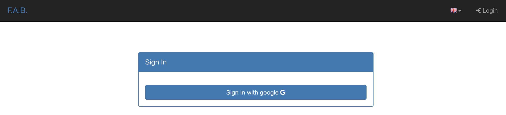
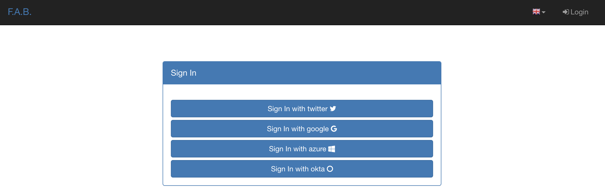

Security
========

Responsible disclosure
----------------------

We want to keep Flask-AppBuilder safe for everyone. If you've discovered a security vulnerability
please report to danielvazgaspar@gmail.com.

Supported Authentication Types
------------------------------

:Database: username and password style that is queried from the database to match. Passwords are kept hashed on the database.
:Open ID: Uses the user's email field to authenticate on Gmail, Yahoo etc...
:LDAP: Authentication against an LDAP server, like Microsoft Active Directory.
:REMOTE_USER: Reads the *REMOTE_USER* web server environ var, and verifies if it's authorized with the framework users table.
       It's the web server responsibility to authenticate the user, useful for intranet sites, when the server (Apache, Nginx)
       is configured to use kerberos, no need for the user to login with username and password on F.A.B.
:OAUTH: Authentication using OAUTH (v1 or v2). You need to install authlib.

Configure the authentication type on config.py, take a look at :doc:`config`

The session is preserved and encrypted using Flask-Login, OpenID requires Flask-OpenID.

Authentication Methods
----------------------

You can choose one from 5 authentication methods. Configure the method to be used
on the **config.py** (when using the create-app, or following the proposed app structure). First the
configuration imports the constants for the authentication methods::

    from flask_appbuilder.security.manager import (
        AUTH_DB,
        AUTH_LDAP,
        AUTH_OAUTH,
        AUTH_OID,
        AUTH_REMOTE_USER
    )

Next you will use the **AUTH_TYPE** key to choose the type::

    AUTH_TYPE = AUTH_DB

Additionally you can customize the name of the builtin roles for Admin and Public accesses::

    AUTH_ROLE_ADMIN = 'My Admin Role Name'
    AUTH_ROLE_PUBLIC = 'My Public Role Name'

Finally you can allow users to self register (take a look at the following chapters for further detail)::

    AUTH_USER_REGISTRATION = True
    AUTH_USER_REGISTRATION_ROLE = "My Public Role Name"

These settings can apply to all the authentication methods. When you create your first admin user
using **flask fab** command line, this user will be authenticated using the authentication method
defined on your **config.py**.

Authentication: Database
------------------------

The database authentication type is the most *simple* one, it authenticates users against an
username and hashed password field kept on your database.

Administrators can create users with passwords, and users can change their passwords. This is all done using the UI.
(You can override and extend the default UI as we'll see on *Your Custom Security*)

Authentication: OpenID
----------------------

This authentication method uses `Flask-OpenID <https://github.com/mitsuhiko/flask-openid>`_. All configuration is done
on **config.py** using OPENID_PROVIDERS key, just add or remove from the list the providers you want to enable::

    AUTH_TYPE = AUTH_OID
    OPENID_PROVIDERS = [
        { 'name': 'Yahoo', 'url': 'https://me.yahoo.com' },
        { 'name': 'AOL', 'url': 'http://openid.aol.com/<username>' },
        { 'name': 'Flickr', 'url': 'http://www.flickr.com/<username>' },
        { 'name': 'MyOpenID', 'url': 'https://www.myopenid.com' }
    ]

Each list entry is a dict with a readable OpenID name and it's url, if the url needs an username just add it using <username>.
The login template for this method will provide a text box for the user to fillout his/her username.

F.A.B. will ask for the 'email' from OpenID, and if this email belongs to some user on your application he/she will login successfully.

Authentication: LDAP
--------------------

This method will authenticate the user's credentials against an LDAP server.

WARNING: To use LDAP you need to install `python-ldap <https://www.python-ldap.org>`_.

For a typical Microsoft AD setup (where all users can preform LDAP searches)::

    AUTH_TYPE = AUTH_LDAP
    AUTH_LDAP_SERVER = "ldap://ldap.example.com"
    AUTH_LDAP_USE_TLS = False

    # registration configs
    AUTH_USER_REGISTRATION = True  # allow users who are not already in the FAB DB
    AUTH_USER_REGISTRATION_ROLE = "Public"  # this role will be given in addition to any AUTH_ROLES_MAPPING
    AUTH_LDAP_FIRSTNAME_FIELD = "givenName"
    AUTH_LDAP_LASTNAME_FIELD = "sn"
    AUTH_LDAP_EMAIL_FIELD = "mail"  # if null in LDAP, email is set to: "{username}@email.notfound"

    # bind username (for password validation)
    AUTH_LDAP_USERNAME_FORMAT = "uid=%s,ou=users,dc=example,dc=com"  # %s is replaced with the provided username
    # AUTH_LDAP_APPEND_DOMAIN = "example.com"  # bind usernames will look like: {USERNAME}@example.com

    # search configs
    AUTH_LDAP_SEARCH = "ou=users,dc=example,dc=com"  # the LDAP search base (if non-empty, a search will ALWAYS happen)
    AUTH_LDAP_UID_FIELD = "uid"  # the username field

For a typical OpenLDAP setup (where LDAP searches require a special account)::

    AUTH_TYPE = AUTH_LDAP
    AUTH_LDAP_SERVER = "ldap://ldap.example.com"
    AUTH_LDAP_USE_TLS = False

    # registration configs
    AUTH_USER_REGISTRATION = True  # allow users who are not already in the FAB DB
    AUTH_USER_REGISTRATION_ROLE = "Public"  # this role will be given in addition to any AUTH_ROLES_MAPPING
    AUTH_LDAP_FIRSTNAME_FIELD = "givenName"
    AUTH_LDAP_LASTNAME_FIELD = "sn"
    AUTH_LDAP_EMAIL_FIELD = "mail"  # if null in LDAP, email is set to: "{username}@email.notfound"

    # search configs
    AUTH_LDAP_SEARCH = "ou=users,dc=example,dc=com"  # the LDAP search base
    AUTH_LDAP_UID_FIELD = "uid"  # the username field
    AUTH_LDAP_BIND_USER = "uid=admin,ou=users,dc=example,dc=com"  # the special bind username for search
    AUTH_LDAP_BIND_PASSWORD = "admin_password"  # the special bind password for search

You can limit the LDAP search scope by configuring::

    # only allow users with memberOf="cn=myTeam,ou=teams,dc=example,dc=com"
    AUTH_LDAP_SEARCH_FILTER = "(memberOf=cn=myTeam,ou=teams,dc=example,dc=com)"

You can give FlaskAppBuilder roles based on LDAP roles (note, this requires AUTH_LDAP_SEARCH to be set)::

    # a mapping from LDAP DN to a list of FAB roles
    AUTH_ROLES_MAPPING = {
        "cn=fab_users,ou=groups,dc=example,dc=com": ["User"],
        "cn=fab_admins,ou=groups,dc=example,dc=com": ["Admin"],
    }

    # the LDAP user attribute which has their role DNs
    AUTH_LDAP_GROUP_FIELD = "memberOf"

    # if we should replace ALL the user's roles each login, or only on registration
    AUTH_ROLES_SYNC_AT_LOGIN = True

    # force users to re-auth after 30min of inactivity (to keep roles in sync)
    PERMANENT_SESSION_LIFETIME = 1800

TLS
~~~

For STARTTLS, configure an `ldap://` server and set `AUTH_LDAP_USE_TLS` to `True`::

    AUTH_LDAP_SERVER = "ldap://ldap.example.com"
    AUTH_LDAP_USE_TLS = True

For LDAP over TLS (ldaps), configure the server with the `ldaps://` scheme and set `AUTH_LDAP_USE_TLS` to `False`::

    AUTH_LDAP_SERVER = "ldaps://ldap.example.com"
    AUTH_LDAP_USE_TLS = False

Additional LDAP/TLS Options, including CA certificate settings and client authentication, can be found in the :doc:`config`.

Authentication: OAuth
---------------------

This method will authenticate the user's credentials against an OAuth provider.

.. note:: To use OAuth you need to install `Python AuthLib <https://authlib.org>`_.

Specify a list of OAUTH_PROVIDERS in **config.py** that you want to allow for your users::

    AUTH_TYPE = AUTH_OAUTH

    # registration configs
    AUTH_USER_REGISTRATION = True  # allow users who are not already in the FAB DB
    AUTH_USER_REGISTRATION_ROLE = "Public"  # this role will be given in addition to any AUTH_ROLES_MAPPING

    # the list of providers which the user can choose from
    OAUTH_PROVIDERS = [
        {
            "name": "twitter",
            "icon": "fa-twitter",
            "token_key": "oauth_token",
            "remote_app": {
                "client_id": "TWITTER_KEY",
                "client_secret": "TWITTER_SECRET",
                "api_base_url": "https://api.twitter.com/1.1/",
                "request_token_url": "https://api.twitter.com/oauth/request_token",
                "access_token_url": "https://api.twitter.com/oauth/access_token",
                "authorize_url": "https://api.twitter.com/oauth/authenticate",
            },
        },
        {
            "name": "google",
            "icon": "fa-google",
            "token_key": "access_token",
            "remote_app": {
                "client_id": "GOOGLE_KEY",
                "client_secret": "GOOGLE_SECRET",
                "api_base_url": "https://www.googleapis.com/oauth2/v2/",
                "client_kwargs": {"scope": "email profile"},
                "request_token_url": None,
                "access_token_url": "https://accounts.google.com/o/oauth2/token",
                "authorize_url": "https://accounts.google.com/o/oauth2/auth",
                "jwks_uri": "https://www.googleapis.com/oauth2/v3/certs",
            },
        },
        {
            "name": "openshift",
            "icon": "fa-circle-o",
            "token_key": "access_token",
            "remote_app": {
                "client_id": "system:serviceaccount:mynamespace:mysa",
                "client_secret": "<mysa serviceaccount token here>",
                "api_base_url": "https://openshift.default.svc.cluster.local:443",
                "client_kwargs": {"scope": "user:info"},
                "redirect_uri": "https://myapp-mynamespace.apps.<cluster_domain>",
                "access_token_url": "https://oauth-openshift.apps.<cluster_domain>/oauth/token",
                "authorize_url": "https://oauth-openshift.apps.<cluster_domain>/oauth/authorize",
                "token_endpoint_auth_method": "client_secret_post",
            },
        },
        {
            "name": "okta",
            "icon": "fa-circle-o",
            "token_key": "access_token",
            "remote_app": {
                "client_id": "OKTA_KEY",
                "client_secret": "OKTA_SECRET",
                "api_base_url": "https://OKTA_DOMAIN.okta.com/oauth2/v1/",
                "client_kwargs": {"scope": "openid profile email groups"},
                "access_token_url": "https://OKTA_DOMAIN.okta.com/oauth2/v1/token",
                "authorize_url": "https://OKTA_DOMAIN.okta.com/oauth2/v1/authorize",
                "server_metadata_url": f"https://OKTA_DOMAIN.okta.com/.well-known/openid-configuration",
            },
        },
        {
            "name": "aws_cognito",
            "icon": "fa-amazon",
            "token_key": "access_token",
            "remote_app": {
                "client_id": "COGNITO_CLIENT_ID",
                "client_secret": "COGNITO_CLIENT_SECRET",
                "api_base_url": "https://COGNITO_APP.auth.REGION.amazoncognito.com/",
                "client_kwargs": {"scope": "openid email aws.cognito.signin.user.admin"},
                "access_token_url": "https://COGNITO_APP.auth.REGION.amazoncognito.com/token",
                "authorize_url": "https://COGNITO_APP.auth.REGION.amazoncognito.com/authorize",
            },
        },
        {
            "name": "keycloak",
            "icon": "fa-key",
            "token_key": "access_token",
            "remote_app": {
                "client_id": "KEYCLOAK_CLIENT_ID",
                "client_secret": "KEYCLOAK_CLIENT_SECRET",   
                "api_base_url": "https://KEYCLOAK_DOMAIN/realms/master/protocol/openid-connect",
                "client_kwargs": {
                    "scope": "email profile"
                },
                "access_token_url": "KEYCLOAK_DOMAIN/realms/master/protocol/openid-connect/token",
                "authorize_url": "KEYCLOAK_DOMAIN/realms/master/protocol/openid-connect/auth",
                "request_token_url": None,
            },
        },
        {
            "name": "keycloak_before_17",
            "icon": "fa-key",
            "token_key": "access_token",
            "remote_app": {
                "client_id": "KEYCLOAK_CLIENT_ID",
                "client_secret": "KEYCLOAK_CLIENT_SECRET",   
                "api_base_url": "https://KEYCLOAK_DOMAIN/auth/realms/master/protocol/openid-connect",
                "client_kwargs": {
                    "scope": "email profile"
                },
                "access_token_url": "KEYCLOAK_DOMAIN/auth/realms/master/protocol/openid-connect/token",
                "authorize_url": "KEYCLOAK_DOMAIN/auth/realms/master/protocol/openid-connect/auth",
                "request_token_url": None,
            },
        },
        {
            "name": "azure",
            "icon": "fa-windows",
            "token_key": "access_token",
            "remote_app": {
                "client_id": "AZURE_APPLICATION_ID",
                "client_secret": "AZURE_SECRET",
                "api_base_url": "https://login.microsoftonline.com/AZURE_TENANT_ID/oauth2",
                "client_kwargs": {
                    "scope": "User.read name preferred_username email profile upn",
                    "resource": "AZURE_APPLICATION_ID",
                },
                "request_token_url": None,
                "access_token_url": "https://login.microsoftonline.com/AZURE_TENANT_ID/oauth2/token",
                "authorize_url": "https://login.microsoftonline.com/AZURE_TENANT_ID/oauth2/authorize",
            },
        },
    ]

This needs a small explanation, you basically have five special keys:

:name: the name of the provider:
    you can choose whatever you want, but FAB has builtin logic in `BaseSecurityManager.get_oauth_user_info()` for:
    'azure', 'github', 'google', 'keycloak', 'keycloak_before_17', 'linkedin', 'okta', 'openshift', 'twitter'

:icon: the font-awesome icon for this provider

:token_key: the token key name that the provider uses, default is *'oauth_token'*

:token_secret: the token secret key name, default is *'oauth_token_secret'*

:remote_app: the actual configs for the provider API

You can give FlaskAppBuilder roles based on Oauth groups::

    # note, this is only natively supported in `azure` and `okta` currently,
    # however, if you customize userinfo retrieval to include 'role_keys', this will work for other providers

    # a mapping from the values of `userinfo["role_keys"]` to a list of FAB roles
    AUTH_ROLES_MAPPING = {
        "FAB_USERS": ["User"],
        "FAB_ADMINS": ["Admin"],
    }

    # if we should replace ALL the user's roles each login, or only on registration
    AUTH_ROLES_SYNC_AT_LOGIN = True

    # force users to re-auth after 30min of inactivity (to keep roles in sync)
    PERMANENT_SESSION_LIFETIME = 1800

To customize the userinfo retrieval, you can create your own method like this::

    @appbuilder.sm.oauth_user_info_getter
    def my_user_info_getter(sm, provider, response=None):
        if provider == "okta":
            me = sm.oauth_remotes[provider].get("userinfo")
            log.debug("User info from Okta: {0}".format(me.data))
            return {
                "username": "okta_" + me.data.get("sub", ""),
                "first_name": me.data.get("given_name", ""),
                "last_name": me.data.get("family_name", ""),
                "email": me.data.get("email", ""),
                "role_keys": me.data.get("groups", []),
            }
        if provider == "aws_cognito":
            me = self.appbuilder.sm.oauth_remotes[provider].get("userInfo")
            return {
                "username": me.json().get("username"),
                "email": me.json().get("email"),
                "first_name": me.json().get("given_name", ""),
                "last_name": me.json().get("family_name", ""),
                "id": me.json().get("sub", ""),
                "role_keys": ["User"], # set AUTH_ROLES_SYNC_AT_LOGIN = False
            }
        else:
            return {}

On Flask-AppBuilder 3.4.0 the login page has changed.

With one provider:

With multiple providers:

Note that on 3.3.X the user would automatically be sent to the provider allow page.

Decorate your method with the SecurityManager **oauth_user_info_getter** decorator.
Your method should return a dictionary with the userinfo, with the keys having the same column names as the User Model.
Your method will be called after the user authorizes your application on the OAuth provider.
Take a look at the `example <https://github.com/dpgaspar/Flask-AppBuilder/tree/master/examples/oauth>`_

You can also use the OAuth provider APIs.
Therefore, you can send tweets, post on the users Facebook, retrieve the user's LinkedIn profile etc.
Take a look at the `example <https://github.com/dpgaspar/Flask-AppBuilder/tree/master/examples/oauth>`_
to get an idea of a simple use for this.

Authentication: Rate limiting
-----------------------------

To prevent brute-forcing of credentials, you can apply rate limits to AuthViews in 4.2.0, so that
only 10 POST requests can be made every 20 seconds. This can be enabled by setting
``AUTH_RATE_LIMITED`` and ``RATELIMIT_ENABLED`` to ``True``.
The rate can be changed by adjusting ``AUTH_RATE_LIMIT`` to, for example, ``1 per 10 seconds``. Take a look
at the `documentation <https://flask-limiter.readthedocs.io/en/stable/>`_ of Flask-Limiter for more options and
examples.

Role based
----------

Each user may have multiple roles, and a role holds permissions on views/API and menus,
so a user has permissions on views/API and menus.

Roles can be user defined (backed by the backend) and builtin readonly. Builtin readonly roles
support regex for views/API and permissions, this simplifies security management and
improve performance since the many to many permissions between a role and it's permissions
does not need to be fetched from the backend.

Builtin roles are defined on the config using ``FAB_ROLES`` key and respect the following data structure::

    FAB_ROLES = {
        "<ROLE NAME>": [
            ["<VIEW/MENU/API NAME>", "PERMISSION NAME"],
            ....
        ],
        ...
    }

So for example a **Read Only** role might look like::

    FAB_ROLES = {
        "ReadOnly": [
            [".*", "can_list"],
            [".*", "can_show"],
            [".*", "menu_access"],
            [".*", "can_get"],
            [".*", "can_info"]
        ]
    }

These roles are inserted automatically to the database (only their name is added), and
can be associated to users just like a "normal"/user defined role.

If you want to later on change the name of these roles, you can map these roles by their backend id::

    FAB_ROLES = {
        "ReadOnly_Altered": [
            [".*", "can_list"],
            [".*", "can_show"],
            [".*", "menu_access"],
            [".*", "can_get"],
            [".*", "can_info"]
        ]
    }

    FAB_ROLES_MAPPING = {
        1: "ReadOnly_Altered"
    }

There are two special roles, you can define their names on the :doc:`config`

:Admin Role: Special builtin read only Role, will have full access.
:Public Role: This is a special role for non authenticated users,
    you can assign all the permissions on views and menus to this role,
    and everyone will access specific parts of you application.

Of course you can create any additional role you want and configure them as you like.

Permissions
-----------

The framework automatically creates for you all the possible existing permissions on your views, API or menus,
by "inspecting" your code.

Each time you create a new view based on a model (inherit from ModelView) it will create the following permissions:

- can list
- can show
- can add
- can edit
- can delete
- can download

In the case of CRUD REST API:

- can get
- can put
- can post
- can delete
- can info

These base permissions will be associated to your view or API, so if you create a view named ``MyModelView``
you can assign to any role the following permissions:

- can list on MyModelView
- can show on MyModelView
- can add on MyModelView
- can edit on MyModelView
- can delete on MyModelView
- can download on MyModelView

In case your developing a backend REST API subclassing ``ModelRestApi`` with a class named ``MyApi`` will
generate the following permissions:

- can get on MyApi
- can put on MyApi
- can post on MyApi
- can delete on MyApi
- can info on MyApi

If you extend your view with some exposed method via the ``@expose`` decorator and you want to protect it
use the ``@has_access`` decorator::

    class MyModelView(ModelView):
        datamodel = SQLAInterface(Group)

        @has_access
        @expose('/mymethod/')
        def mymethod(self):
            # do something
            pass

The framework will create the following access, based on your method's name:

- can mymethod on MyModelView

You can aggregate some of your method's on a single permission, this can simplify the security configuration
if there is no need for granular permissions on a group of methods, for this use ``@permission_name`` decorator.

You can use the ``@permission_name`` to override the permission's name to whatever you like.

Take a look at :doc:`api`

Permission Customization
------------------------

The default view/menu, permissions are highly granular, this is a good default since it enables a high level
of customization, but on medium to large application the amount of permission pairs generated can get a bit daunting.
You can fully customize the generated permission names generated and if you wish aggregate them::

    class OneApi(ModelRestApi):
        datamodel = SQLAInterface(Contact)
        class_permission_name = "api"

    class TwoApi(ModelRestApi):
        datamodel = SQLAInterface(Contact)
        class_permission_name = "api"

The previous example will generate half the default permissions, by just creating the following:

- can get on api
- can put on api
- can post on api
- can delete on api
- can info on api

The ``class_permission_name`` property is available also on BaseViews and their children ``ModelView``,
``MultipleView``, ``MasterDetailView``, ``FormView``, etc.

You can also aggregate method permissions by using ``method_permission_name`` attribute.
Use the following ``Dict`` structure::

    method_permission_name = {
        "<METHOD_NAME>": "<PERMISSION_NAME>",
        ...
    }

Example::

    class OneApi(ModelRestApi):
        datamodel = SQLAInterface(Contact)
        class_permission_name = "api"
        method_permission_name = {
            "get_list": "access",
            "get": "access",
            "post": "access",
            "put": "access",
            "delete": "access",
            "info": "access"
        }

    class TwoApi(ModelRestApi):
        datamodel = SQLAInterface(Contact)
        class_permission_name = "api"
        method_permission_name = {
            "get_list": "access",
            "get": "access",
            "post": "access",
            "put": "access",
            "delete": "access",
            "info": "access"
        }

Now FAB will only generate one permission pair:

- can access on api

If you want to revert back your permission names override, or change just them again, you need to hint FAB
about what were your last permissions, so that the security converge procedure knows what to do::

    class OneApi(ModelRestApi):
        datamodel = SQLAInterface(Contact)
        class_permission_name = "OneApi"
        previous_class_permission_name = "api"
        method_permission_name = {
            "get_list": "get",
            "get": "get",
            "post": "post",
            "put": "put",
            "delete": "delete",
            "info": "info"
        }
        previous_method_permission_name = {
            "get_list": "access",
            "get": "access",
            "post": "access",
            "put": "access",
            "delete": "access",
            "info": "access"
        }

An example for compressing permissions using MVC Model Views::

    class OneView(ModelView):
        datamodel = SQLAInterface(Contact)
        class_permission_name = "view"
        method_permission_name = {
            'add': 'write',
            'delete': 'write',
            'download': 'write',
            'edit': 'write',
            'list': 'read',
            'muldelete': 'write',
            'show': 'read',
            'api': 'read',
            'api_column_add': 'write',
            'api_column_edit': 'write',
            'api_create': 'write',
            'api_delete': 'write',
            'api_get': 'read',
            'api_read': 'read',
            'api_readvalues': 'read',
            'api_update': 'write'
        }

Note that if your changing an already existing application, you need to migrate the old permission names to the new
ones. Before doing that you should disable the boot automatic create/delete permissions,
so set ``FAB_UPDATE_PERMS = False``. Then run the following FAB cli command::

    $ flask fab security-converge

Security converge will migrate all your permissions from the previous names to the current names, and
also change all your roles, so you can migrate smoothly to your new security naming. After converging
you can delete all your ``previous_*`` attributes if you have set them.

You can also migrate back by switching ``previous_*`` attributes to their target, ie switch
``previous_method_permission_name`` by ``method_permission_name`` and
``previous_class_permission_name`` by ``class_permission_name``.
Then run security converge will expand back all permissions
on all your Roles.

:note: You should backup your production database before migrating your permissions. Also note that you
       can run ``flask fab security-converge --dry-run`` to get a list of operations the converge will perform.

Automatic Cleanup
-----------------

All your permissions and views are added automatically to the backend and associated with the 'Admin' *role*.
The same applies to removing them. But, if you change the name of a view or menu, the framework
will add the new *Views* and *Menus* names to the backend, but will not delete the old ones. It will generate unwanted
names on the security models, basically *garbage*. To clean them, use the *security_cleanup* method.

Using security_cleanup is not always necessary, but using it after code rework, will guarantee that the permissions, and
associated permissions to menus and views are exactly what exists on your app. It will prevent orphaned permission names
and associations.

Use the cleanup after you have registered all your views.
::

    appbuilder.add_view(GroupModelView, "List Groups", category="Contacts")
    appbuilder.add_view(ContactModelView, "List Contacts", category="Contacts")
    appbuilder.add_separator("Contacts")
    appbuilder.add_view(ContactChartView, "Contacts Chart", category="Contacts")
    appbuilder.add_view(ContactTimeChartView, "Contacts Birth Chart", category="Contacts")

    appbuilder.security_cleanup()

You can always use it and everything will be painlessly automatic. But if you use it only when needed
(change class name, add *security_cleanup* to your code, the *garbage* names are removed, then remove the method)
no overhead is added when starting your site.

Auditing
--------

All user's creation and modification are audited.
On the show detail for each user you can check who created the user and when and who has last changed it.

You can check also, a total login count (successful login), and the last failed logins
(these are reset if a successful login occurred).

If you're using SQLAlchemy you can mix auditing to your models in a simple way. Mix AuditMixin class to your models::

    from flask_appbuilder.models.mixins import AuditMixin
    from flask_appbuilder import Model
    from sqlalchemy import Column, Integer, String

    class Project(AuditMixin, Model):
        id = Column(Integer, primary_key=True)
        name = Column(String(150), unique=True, nullable=False)

This will add the following columns to your model:

- created_on: The date and time of the record creation.
- changed_on: The last date and time of record update.
- created_by: Who created the record.
- changed_by: Who last modified the record.

These columns will be automatically updated by the framework upon creation or update of records. So you should
exclude them from add and edit form. Using our example you will define our view like this::

    class ProjectModelView(ModelView):
        datamodel = SQLAInterface(Project)
        add_columns = ['name']
        edit_columns = ['name']

Password complexity validation
------------------------------

This feature only makes sense when using AUTH database.
By default you can enable password complexity validation by setting `FAB_PASSWORD_COMPLEXITY_ENABLED = True`.

This default enforces:

- At least 2 Uppercase letters
- At least 3 Lowercase letters
- At least 1 special character
- At least 2 numeric digits
- At least 10 total characters

If you want to set your own password complexity validation, you can write your own validation function:

Example on your config::

    from flask_appbuilder.exceptions import PasswordComplexityValidationError
    ...

    def custom_password_validator(password: str) -> None:
        """
        A simplistic example for a password validator
        """
        if len(password) < 8:
            raise PasswordComplexityValidationError("Must have at least 8 characters")

    FAB_PASSWORD_COMPLEXITY_VALIDATOR = custom_password_validator
    FAB_PASSWORD_COMPLEXITY_ENABLED = True

Your Custom Security
--------------------

If you want to alter the security views, or authentication methods since (1.0.1) you can do it in a simple way.
The **AppBuilder** has a new optional initialization parameter where you pass your own custom **SecurityManager**
If you want to add, for example, actions to the list of users you can do it in a simple way.

First i advise you to create security.py and add the following to it::

    from flask import redirect
    from flask_appbuilder.security.views import UserDBModelView
    from flask_appbuilder.security.sqla.manager import SecurityManager
    from flask_appbuilder.actions import action

    class MyUserDBView(UserDBModelView):
        @action("muldelete", "Delete", "Delete all Really?", "fa-rocket", single=False)
        def muldelete(self, items):
            self.datamodel.delete_all(items)
            self.update_redirect()
            return redirect(self.get_redirect())

    class MySecurityManager(SecurityManager):
        userdbmodelview = MyUserDBView

Then on the __init__.py initialize AppBuilder with you own security class::

    appbuilder = AppBuilder(app, db.session, security_manager_class=MySecurityManager)

Alternatively since 1.13.1 you can declare your custom **SecurityManager** on the config.
This is a must have if your using the factory app pattern, on the config declare you class the following way::

    FAB_SECURITY_MANAGER_CLASS='app.security.MySecurityManager'

F.A.B. uses a different user view for each authentication method

:UserDBModelView: For database auth method
:UserOIDModelView: For Open ID auth method
:UserLDAPModelView: For LDAP auth method

You can extend or create from scratch your own, and then tell F.A.B. to use them instead, by overriding their
correspondent lower case properties on **SecurityManager** (just like on the given example).

Take a look and run the example on `Employees example <https://github.com/dpgaspar/Flask-AppBuilder/tree/master/examples/employees>`_

Study the source code of `BaseSecurityManager <https://github.com/dpgaspar/Flask-AppBuilder/blob/master/flask_appbuilder/security/manager.py>`_

Extending the User Model
------------------------

If you want to extend the **User** Model with extra columns specific to your application (since 1.3.0) you
can easily do it. Use the same type of approach as explained earlier.

First extend the User Model (create a sec_models.py file)::

    from flask_appbuilder.security.sqla.models import User
    from sqlalchemy import Column, Integer, ForeignKey, String, Sequence, Table
    from sqlalchemy.orm import relationship, backref
    from flask_appbuilder import Model

    class MyUser(User):
        __tablename__ = 'ab_user'
        extra = Column(String(256))

Next define a new User view, just like the default User view but with the extra column (create a sec_views.py)
If you're using:

:AUTH_DB: Extend UserDBModelView
:AUTH_LDAP: Extend UserLDAPModelView
:AUTH_REMOTE_USER: Extend UserRemoteUserModelView
:AUTH_OID: Extend UserOIDModelView
:AUTH_OAUTH: Extend UserOAuthModelView

So using AUTH_DB::

    from flask_appbuilder.security.views import UserDBModelView
    from flask_babel import lazy_gettext

    class MyUserDBModelView(UserDBModelView):
        """
            View that add DB specifics to User view.
            Override to implement your own custom view.
            Then override userdbmodelview property on SecurityManager
        """

        show_fieldsets = [
            (lazy_gettext('User info'),
             {'fields': ['username', 'active', 'roles', 'login_count', 'extra']}),
            (lazy_gettext('Personal Info'),
             {'fields': ['first_name', 'last_name', 'email'], 'expanded': True}),
            (lazy_gettext('Audit Info'),
             {'fields': ['last_login', 'fail_login_count', 'created_on',
                         'created_by', 'changed_on', 'changed_by'], 'expanded': False}),
        ]

        user_show_fieldsets = [
            (lazy_gettext('User info'),
             {'fields': ['username', 'active', 'roles', 'login_count', 'extra']}),
            (lazy_gettext('Personal Info'),
             {'fields': ['first_name', 'last_name', 'email'], 'expanded': True}),
        ]

        add_columns = [
            'first_name',
            'last_name',
            'username',
            'active',
            'email',
            'roles',
            'extra',
            'password',
            'conf_password'
        ]
        list_columns = [
            'first_name',
            'last_name',
            'username',
            'email',
            'active',
            'roles'
        ]
        edit_columns = [
            'first_name',
            'last_name',
            'username',
            'active',
            'email',
            'roles',
            'extra'
        ]

Next create your own SecurityManager class, overriding your model and view for User (create a sec.py)::

    from flask_appbuilder.security.sqla.manager import SecurityManager
    from .sec_models import MyUser
    from .sec_views import MyUserDBModelView

    class MySecurityManager(SecurityManager):
        user_model = MyUser
        userdbmodelview = MyUserDBModelView

Note that this is for AUTH_DB, so if you're using:

:AUTH_DB: Override userdbmodelview
:AUTH_LDAP: Override userldapmodelview
:AUTH_REMOTE_USER: Override userremoteusermodelview
:AUTH_OID: Override useroidmodelview

Finally (as shown on the previous example) tell F.A.B. to use your SecurityManager class, so when initializing
**AppBuilder** (on __init__.py)::

    from flask import Flask
    from flask_appbuilder import SQLA, AppBuilder
    from flask_appbuilder.menu import Menu
    from .sec import MySecurityManager

    app = Flask(__name__)
    app.config.from_object('config')
    db = SQLA(app)
    appbuilder = AppBuilder(app, db.session, menu=Menu(reverse=False), security_manager_class=MySecurityManager)

    from app import views

Now you'll have your extended User model as the authenticated user, *g.user* will have your model with the extra col.

Some images:

.. image:: ./images/security.png
    :width: 100%
