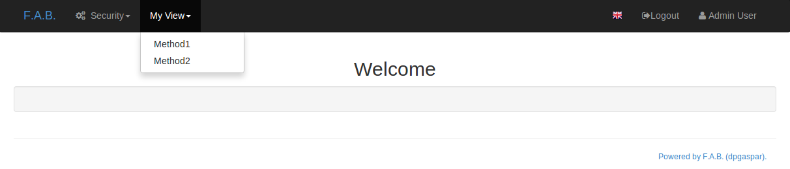

Base Views
==========

Views are the base concept of F.A.B.
They work like a class that represent a concept and present the views and methods to implement it.

Each view is a Flask blueprint that will be created for you automatically by the framework.
This is a simple but powerful concept.
You will map your methods to routing points, and each method will be registered
as a possible security permission if you want.

So your methods will have automatic routing points much like Flask, but this time in a class.
Additionally you can have granular security (method access security) that can be associated with a user's role
(take a look at :doc:`security` for more detail).

The views documented on this chapter are the building blocks of F.A.B, but the juicy part is on the next chapter
with ModelView, ChartView and others.

BaseView
--------

All views inherit from this class.
Its constructor will register your exposed urls on flask as a Blueprint,
as well as all security permissions that need to be defined and protected.

You can use this kind of view to implement your own custom pages,
attach it to a menu or link it from any point to your site.

Decorate your url routing methods with **@expose**.
Additionally add **@has_access** decorator to tell flask that this is a security protected method.

Using the Flask-AppBuilder-Skeleton (take a look at the :doc:`installation` chapter). Edit views.py file and add::

    from flask_appbuilder import AppBuilder, expose, BaseView
    from app import appbuilder

    class MyView(BaseView):
        route_base = "/myview"

        @expose('/method1/<string:param1>')
        def method1(self, param1):
            # do something with param1
            # and return it
            return param1

        @expose('/method2/<string:param1>')
        def method2(self, param1):
            # do something with param1
            # and render it
            param1 = 'Hello %s' % (param1)
            return param1

    appbuilder.add_view_no_menu(MyView())
    
    
You can find this example on `SimpleView1 <https://github.com/dpgaspar/Flask-AppBuilder/tree/master/examples/simpleview1>`_
look at the file app/views.py

This simple example will register your view with two routing urls on:

- /myview/method1/<string:param1>
- /myview/method2/<string:param1>
    
No menu will be created for this and no security permissions will be created.
If you want to enable detailed security access for your methods use the **@has_access** decorator.

Now run this example::

    $ export FLASK_APP=app
    $ flask run

You can test your methods using the following urls:

http://localhost:8080/myview/method1/john

http://localhost:8080/myview/method2/john

As you can see, those methods are public. So let's secure them. Change views.py to::

    from flask_appbuilder import AppBuilder, BaseView, expose, has_access
    from app import appbuilder

    class MyView(BaseView):

        default_view = 'method1'

        @expose('/method1/')
        @has_access
        def method1(self):
            # do something with param1
            # and return to previous page or index
            return 'Hello'

        @expose('/method2/<string:param1>')
        @has_access
        def method2(self, param1):
            # do something with param1
            # and render template with param
            param1 = 'Goodbye %s' % (param1)
            return param1

    appbuilder.add_view(MyView, "Method1", category='My View')
    appbuilder.add_link("Method2", href='/myview/method2/john', category='My View')

You can find this example on `SimpleView2 <https://github.com/dpgaspar/Flask-AppBuilder/tree/master/examples/simpleview2>`_.
Take a look at their definition:

.. automodule:: flask_appbuilder.baseviews

    .. autofunction:: expose

.. automodule:: flask_appbuilder.security.decorators

    .. autofunction:: has_access

This will create the following menu

Notice that these methods will render simple pages not integrated with F.A.B's look and feel.
It's easy to render your method's response integrated with the app's look and feel,
for this you have to create your own template.
Under your project's directory and app folder create a folder named 'templates'.
Inside it create a file name 'method3.html'

1 - Develop your template (on your <PROJECT_NAME>/app/templates/method3.html)::

    
    
        <h1>{{param1}}</h1>
    

2 - Add the following method on your *MyView* class::

    from flask import render_template
    
    @expose('/method3/<string:param1>')
    @has_access
    def method3(self, param1):
        # do something with param1
        # and render template with param
        param1 = 'Goodbye %s' % (param1)
        self.update_redirect()
        return self.render_template('method3.html',
                               param1 = param1)

3 - Create a menu link to your new method::

    appbuilder.add_link("Method3", href='/myview/method3/john', category='My View')

As you can see you just have to extend "appbuilder/base.html" on your template and then override *block content*.
You have many other *blocks* to override or extend things like css includes, javascript, headers, tails etc...
Next use **Flask** **render_template** to render your new template.

.. note::

    Update redirect, on version 0.10.3, the redirect algorithm was reviewed, and uses session cookies to keep
    5 records of navigation history. This is very useful to redirect back, keeping url arguments and
    improving UI experience. You must call *self.update_redirect()* to insert the current url into the
    navigation history. Sometimes you may want to skip the update, for example on form validation errors, so that
    the *back* operation won't send you to the same form, prior to the validation error.

.. note::

    Since version 1.3.0, you must render all your views templates like *self.render_template* this
    is because the base_template (that can be overridden) and appbuilder are now always passed to the template.

Form Views
----------

Subclass SimpleFormView or PublicFormView to provide base processing for your customized form views.

Usually you will need this kind of view to present forms that are not Database Model based,
because when they do, F.A.B. can automatically generate them and you can add or remove fields to it,
as well as custom validators. For this you can use ModelView instead.

To create a custom form view, first define your `WTForm <https://wtforms.readthedocs.org/en/latest/>`_
fields and inherit them from F.A.B. *DynamicForm*.

::

    from wtforms import Form, StringField
    from wtforms.validators import DataRequired
    from flask_appbuilder.fieldwidgets import BS3TextFieldWidget
    from flask_appbuilder.forms import DynamicForm

    class MyForm(DynamicForm):
        field1 = StringField(('Field1'),
            description=('Your field number one!'),
            validators = [DataRequired()], widget=BS3TextFieldWidget())
        field2 = StringField(('Field2'),
            description=('Your field number two!'), widget=BS3TextFieldWidget())

Now define your form view to expose urls, create a menu entry, create security accesses, define pre and post processing.

Implement *form_get* and *form_post* to implement your form pre-processing and post-processing. 
You can use *form_get* to prefill the form with your data, and/or pre process something on your application, then
use *form_post* to post process the form after the user submits it, you can save the data to database, send an email
or any other action required.

On your form_post method, you can also return None, or a Flask response to render a custom template or redirect the user.

::

    from flask import flash
    from flask_appbuilder import SimpleFormView
    from flask_babel import lazy_gettext as _

    class MyFormView(SimpleFormView):
        form = MyForm
        form_title = 'This is my first form view'
        message = 'My form submitted'

        def form_get(self, form):
            form.field1.data = 'This was prefilled'

        def form_post(self, form):
            # post process form
            flash(self.message, 'info')

    appbuilder.add_view(MyFormView, "My form View", icon="fa-group", label=_('My form View'),
                         category="My Forms", category_icon="fa-cogs")

Notice that this class derives from *BaseView* so all properties from the parent class can be overridden.
Notice also how label uses babel's lazy_gettext as _('text') function so that your menu items can be translated.

Most important Base Properties:

:form_title: The title to be presented (this is mandatory)
:form_columns: The form column names to include
:form: Your form class (`WTForm <https://wtforms.readthedocs.org/en/latest/>`_) (this is mandatory) 
    
You can find this example on `SimpleForm <https://github.com/dpgaspar/Flask-AppBuilder/tree/master/examples/simpleform>`_.

